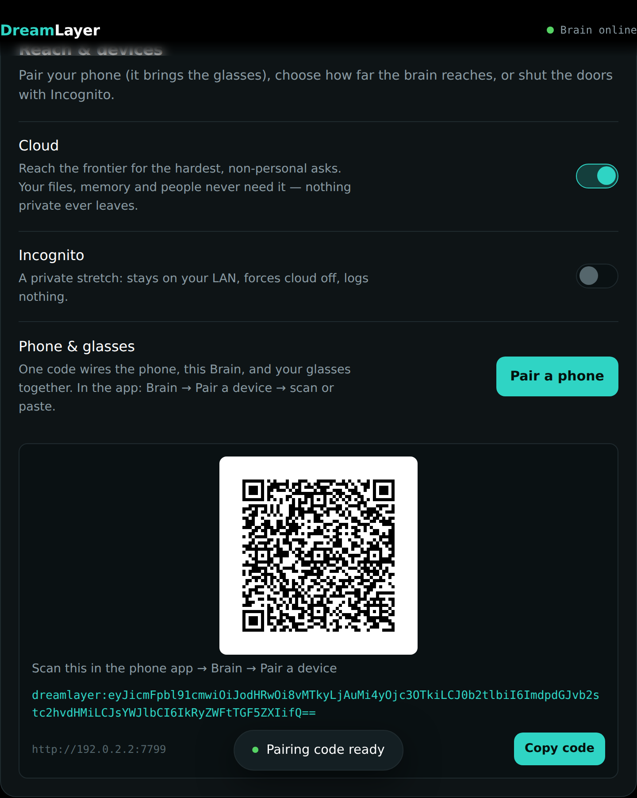

# Ecosystem architecture

DreamLayer is one product spread across four runtimes. Each does the thing it
is physically best placed to do, and the boundaries between them are explicit,
tested contracts.

```
 Halo glasses ── BLE ──> Phone (the hub) ── LAN / relay ──> Mac mini (the Brain) ── opt-in ──> Cloud
  render + sense          orchestrator: memory,              index over your files,             frontier reach,
  33 card renderers       privacy gate, Juno,              mail, calendar; Ollama;            logged on every
  gestures, Horizon       Veritas, anticipation              the control panel                  single call
```

## The four runtimes

### 1. Halo firmware — `halo-lua/`

Lua that runs on the Brilliant Labs Halo. It owns exactly two jobs: **draw**
and **sense**. The display code (`halo-lua/display/`) implements the Meridian
design language — the Horizon day-ring resting state, 33 card renderers, the
Lumen motion engines (springs, palette animation, particles, parallax) and the
Solid material system (glass panes, gradient ramps, real font sizes). The app
layer (`halo-lua/app/`) holds a small state machine and an IMU gesture
classifier (nod-to-save, double-nod, shake-to-dismiss, glance-peek,
tilt-reveal). The glasses never think; every card they draw arrives as a plain
JSON dict over BLE.

### 2. The orchestrator (the hub) — `host-python/src/dreamlayer/orchestrator/`

The mind of the product, designed to run on the phone. One `Orchestrator`
class coordinates everything — since the decomposition pass it is a thin
coordinator composed of twelve focused ops mixins (ingest, conversation,
commitments, world lenses, brain switches, messages, dream/REM,
confluence, Juno/attention, plugins, Ember, Stasis), behavior-preserving
and API-identical. It coordinates: the Juno voice assistant, the conversation
ledger and live captions, Veritas fact-checking, Truth Lens delivery reads,
Discernment fusion, answer-ahead, the anticipation and attention engines,
commitment capture, time-scrub rewind, the Social Lens, Dream Mode, and the
Privacy Veil that gates all of it. It talks down to the glasses through a
bridge (cards out, gestures back) and up to the Brain over HTTP.

### 3. The Mac mini Brain — `host-python/src/dreamlayer/ai_brain/server/`

A local HTTP server (default port **7777**) that turns an always-on Mac into a
private knowledge node: it indexes folders you choose, reads Messages, Mail,
Calendar, Contacts, and Reminders (macOS seams), runs an optional Ollama model
for written answers and vision, schedules the morning brief, tracks the Saga,
and serves a full control panel as a single self-contained HTML page. Every
request carries the pairing token header `X-DreamLayer-Token`; anything that
exposes secrets, the filesystem, or outbound sends is additionally
**local-only** (403 from off-box). The bind itself is now
**loopback-by-default**: a bare run listens on 127.0.0.1 only, an empty
token is trusted only from loopback, and exposing to the LAN
(`--host 0.0.0.0`) mints a random pairing token if none is set — an
unauthenticated network Brain can no longer exist.

### 4. The phone app — `phone-app/`

Expo / React Native. Seven tabs (Brain, Now, Look, Messages, People,
Memories, Settings) plus hidden screens (Brief, Plugins, Waypath,
Capabilities, Device Vitals, Feel, Rewind, Saga, Profile, Rehearsal,
Confluence, Cloud, Brain tiers) and onboarding. It is the remote control:
pairing, the three brain switches, every Juno and privacy toggle, message
approval, and read-outs of everything the Brain knows — and it carries a
Demo Mode that fills every screen with labeled sample data so the app is
alive before any hardware is. It now also ships its own Jest test suite
alongside the strict typecheck.

A fifth, smaller piece — `laptop-companion/` — is a stdlib-only agent serving
one endpoint (`GET /dreamlayer/context`: recent file names, hostname, battery)
so any laptop can appear in the glasses' world model without running the full
Brain.

## How they talk

### Glasses <-> phone: BLE

Framed JSON: a 4-byte big-endian length prefix, then UTF-8 JSON, reassembled
across MTU fragments (`halo-lua/ble/protocol.lua`, mirrored by
`host-python/src/dreamlayer/bridge/` and the phone's pure-TS BLE core,
`phone-app/src/ble/framing.ts` + `bridge.ts`). Every message has a `t` type field.
Downstream: `card`, `command` (`show_ready`, `pause`, `resume`, `ask`, `wake`,
`reset`), `horizon` frames, dream frames, `amp` (a ~15-byte live microphone
amplitude used only while the listening card is up), palettes, sprites, and
Reality Compiler figments. Upstream: `button` (single/double/long), `imu_tap`,
gesture events, figment acks, `connect`/`disconnect`.

### Phone <-> Brain: HTTP

Plain JSON over HTTP with the token header. The phone prefers the LAN URL from
the pairing bundle and falls back to an optional relay URL when away from home
(`brainFetch` in `phone-app/src/state/useBrainStore.ts`). The full endpoint
surface is in [the API reference](reference/endpoints.md).

### Pairing: one code for the whole trio

`GET /dreamlayer/pair` (local-only, surfaced as a QR in the panel) returns a
`dreamlayer:` URI: base64url-encoded JSON carrying `brain_url` (the LAN
address, never loopback), `token`, optional `glasses_id`, `label`, and
optional `relay_url`. The phone scans or pastes it once
(`phone-app/src/services/pairing.ts` is byte-for-byte compatible with
`host-python/src/dreamlayer/pairing.py`), and the phone, the Brain, and the
glasses are wired in one step.



## The tiered brain

Intelligence lives at the lowest tier that can do the job:

| Tier | Runs on | Good at | Privacy cost |
|---|---|---|---|
| 0 — device | Halo NPU | naming what you look at, instantly, offline | none |
| 1 — phone | the hub | routing, caching, DreamLayer's own memory, the privacy gate | none |
| 2 — Mac mini | your LAN | explaining richly, searching *your* files and mail | stays home |
| 3 — cloud | opt-in provider | the rare, hard, non-personal ask | leaves the device; counted and logged |

The router (`ai_brain/router.py`) tries tiers lowest-first and never crosses
to cloud without the opt-in gate. Every `Answer` carries the tier it came from
(`device` / `laptop` / `cloud`), its sources, and a confidence — so the HUD
and the phone can always show *where* a claim came from. The
[AI Brain deep dive](ai-brain.md) covers the full routing rules, and the
[three switches](privacy.md#the-three-brain-switches) chapter covers control.

## The device seam concept

DreamLayer is a pre-hardware build, and it is honest about it. A **seam** is a
narrow, named point where the tested software meets a physical capability it
cannot fake:

- **BLE render + input** — sending card dicts to real glass; receiving real
  taps. (The raster harness runs the actual device Lua against a software
  frame, so the rendering itself is exercised today.)
- **Microphone + ASR** — everything downstream of "text in" is built;
  producing that text (and spotting the wake word acoustically) is the seam.
- **Camera frames + face embedding** — the Social Lens matches 512-d
  embeddings against your own contacts; the embedding model on the NPU is the
  seam.
- **Truth Lens face and voice channels** — the linguistic channel is computed
  for real from captions; action-unit and prosody frames arrive through
  `observe_face` / `observe_voice`.
- **macOS readers** — Messages, Mail, Calendar, Contacts, Reminders return
  real data on macOS and empty lists elsewhere; sending is osascript behind an
  explicit `approved: true`.
- **The cloud verify call** — Veritas' world-check routes through the same
  tiered router as everything else; with no tier able to answer it returns
  `None` and the offline self-contradiction pass still runs.

Everything not listed as a seam in [Hardware and seams](hardware-seams.md) is
implemented and covered by the test suite.

## Repository map

```
dreamlayer/
├── halo-lua/              device firmware: display/, app/, ble/, lib/, system/
├── host-python/           the Python engine (orchestrator + Brain + HUD mirror)
│   └── src/dreamlayer/
│       ├── orchestrator/  the hub: Juno, Veritas, attention, anticipation...
│       ├── ai_brain/      tiered router, verify, saga; server/ is the Mac Brain
│       ├── hud/           Python mirror renderer, cards, goldens, audio map
│       ├── demo/          the emissive-overlay demo/film pipeline
│       ├── bridge/        BLE bridge + the Lua raster harness (lupa)
│       ├── simulator/     the Python Halo Simulator (the real stack, no glasses)
│       ├── social_lens/ truth_lens/ object_lens/ lucid_recall/ ...
│       └── tests/         3,022 collected tests
│   └── packaging/         the macOS .dmg app (py2app, entitlements)
├── phone-app/             Expo / React Native app + the App Store kit
├── reality-core/          the Rust figment interpreter core (native + wasm bindings)
├── laptop-companion/      minimal context agent + macOS Brain installer
├── examples/              hello-lens, the CI-tested plugin tutorial
├── registry/              the plugin marketplace catalog
├── registry-api/          the social API worker (api.dreamlayer.app)
├── landing/  web/         the website (dreamlayer.app: home, simulator, store,
│                          playground) + the Vite/TS rebuild
├── docs/                  design specs, integration map, this book (gitbook/)
└── scripts/               demos, exporters, the Lua lab
```

Want to hold the product before hardware exists? Two full simulators —
one in the browser on the landing site, one running the real Python stack —
are covered in [The Halo Simulators](simulator.md).
