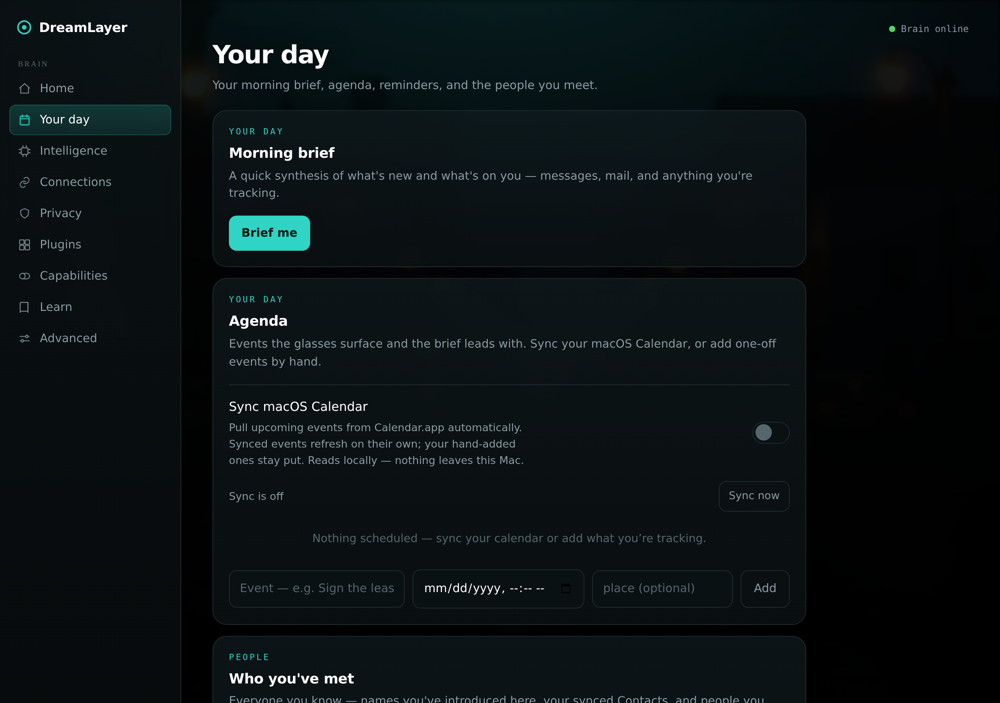
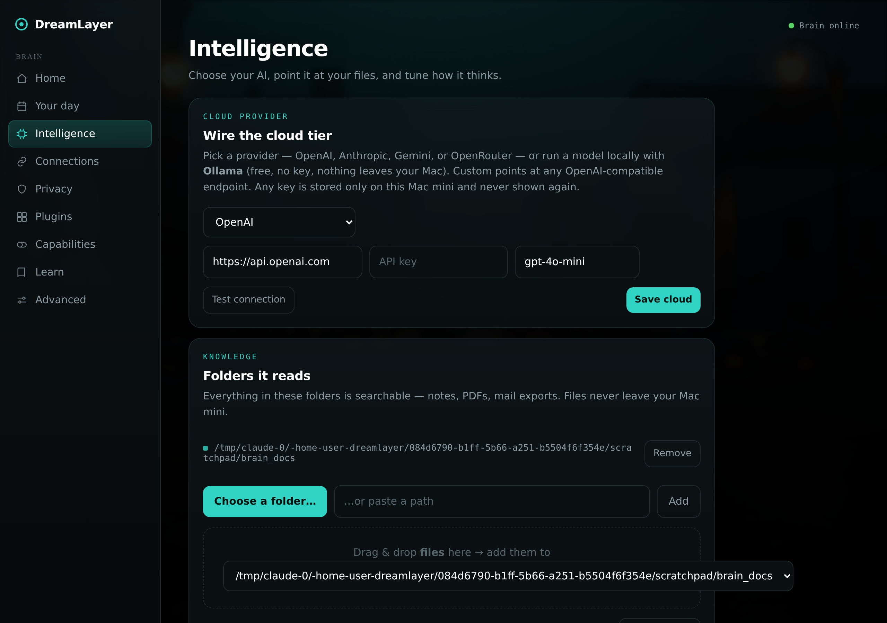
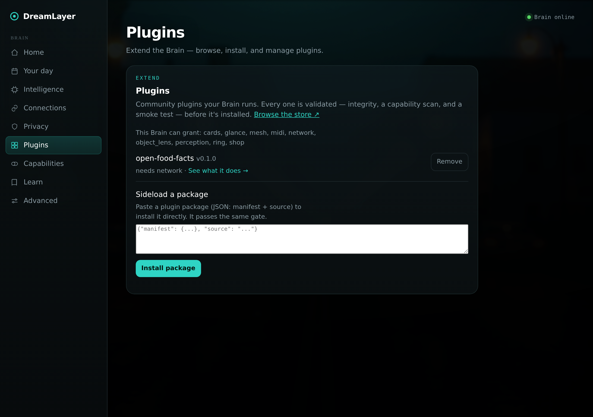
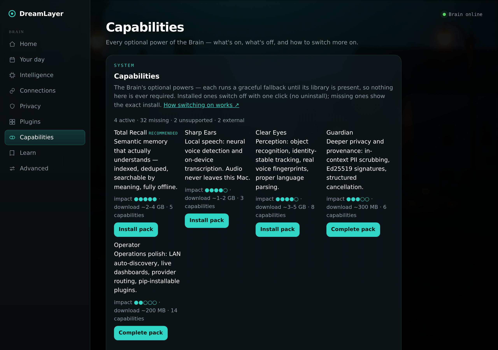
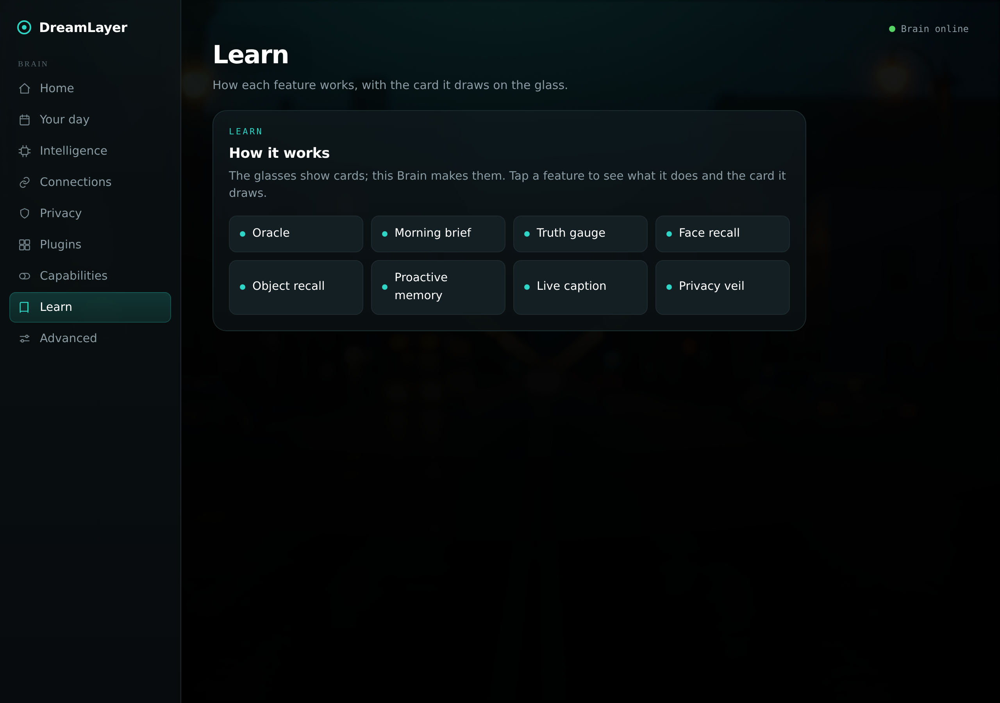
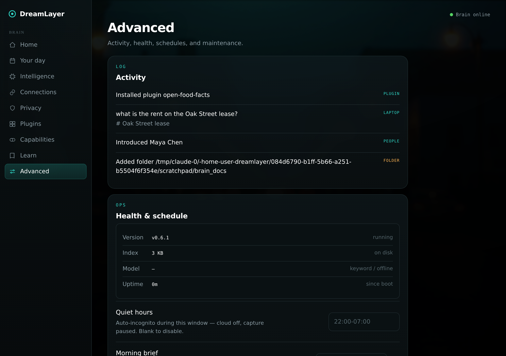

# The desktop Brain app

The Brain is now a real Mac app: a signed, notarized **DreamLayer.dmg** you
double-click, living in the menu bar, serving a cinematic control panel in
its own native window. Underneath it is the same open Python server
(`host-python/src/dreamlayer/ai_brain/`) — anything in this chapter also
works from a plain `python -m dreamlayer.ai_brain.server` on any OS, in any
browser.

*Every screenshot below is the actual panel, booted from this repository
and captured headlessly with a seeded index.*

## Getting it

- **Download:** the site's "Download for Mac" buttons point at the latest
  notarized dmg on this repository's [Releases page](https://github.com/LetsGetToWorkBro/dreamlayer/releases/latest).
  CI builds it on every version tag: py2app bundle, every nested library
  signed, hardened runtime, Apple notarization, stapled.
- On first launch it mints a pairing token, starts the server on port 7777,
  begins the folder watcher, brief scheduler, and calendar sync, and sits
  in the menu bar (no Dock icon): a status dot, **Open panel**, **Sync
  now**, and **Incognito**. State lives in `~/.dreamlayer`; the app never
  writes inside its own bundle. A login LaunchAgent is one flag away.
- **Open panel** opens a native window (a WebKit view onto the same
  localhost page); off macOS, or if WebKit is unavailable, it falls back to
  your browser. Same HTML either way.

## The app layout — nine views

The panel is now a real application layout: a left sidebar, one view at a
time.

### Home


What's connected (Brain, model, cloud, incognito, phone, index) polled
live, a first-run nudge when upgrade packs are available, and the **Plan**
card: "Free - local & open" — with the honest framing that every feature in
the app is free, and a working notify-me waitlist for
[DreamLayer Cloud](cloud.md). Home also carries **"Your memory is a
file"** — the panel's Memory Grep card: where the SQLite memory store
lives, a one-click read-only browse (Datasette, local-only), and an
export-a-copy button, so owning your data needs no terminal.

### Your day



The morning brief (compose on demand; the extended **long brief** adds
sections — Today, Due, Waiting on you, Messages spelled out, Yesterday —
cached at `GET /dreamlayer/brief/long/latest` and rendered by the phone's
Brief screen), the agenda with macOS Calendar sync, the unified people list
(the dossier registry merged by name with the glasses' social memory —
relationship, notes, owed-favor chips, a "met on Halo" badge), and
Reminders.

### Intelligence



Folders it reads (server-side browser, drag-and-drop, filters, reindex),
Ask your stuff, and the **Model** card — now multi-provider: the local
model is Ollama with per-model status and one-click pulls, and the cloud
tier speaks **seven provider presets across three wire formats** — OpenAI,
Anthropic, Gemini, OpenRouter, Ollama-local (key-free), the DreamLayer
Cloud preset, and Custom for any OpenAI-compatible endpoint (LM Studio,
llama.cpp, and friends). Beside the cloud wiring sits the trust
centerpiece, **"What the cloud can see"** — rendered live from
`GET /dreamlayer/cloud`: what the server currently holds (with no cloud
configured, honestly nothing) and the three things it can never see —
your memories, who you are, what a figment means. See
[DreamLayer Cloud](cloud.md).

### Connections, Privacy


Pairing (one QR), the cloud and incognito switches, and message relay. The
Privacy view keeps the token, the egress counter, backup/restore, and
erase — plus the purge contract: the phone's "Erase all memories" now
reaches all the way here (`POST /dreamlayer/memories/purge`), dropping
every saved place while deliberately leaving people and reminders, which
are mirrors of their own surfaces.

### Plugins



Installed plugins with their permissions, what this Brain can grant,
per-plugin remove, and sideloading through the same validation gate — plus
the door for people who don't write code: **"Build a lens →"** opens
[the Lens Builder](lens-builder.md) served by this very Brain at
`/dreamlayer/build`, where deploys land one click away. Phone
installs are real now too: the phone fetches the package from the registry
and sideloads it here, surfacing this Brain's actual verdict.

### Capabilities



The live [capability report](integrations.md): all 42 optional
capabilities grouped by tier, each with a status dot (active / off /
missing / unsupported / external), an impact rating, and either a one-click
**Turn on / Turn off** or the exact `pip install` to get it — plus the five
**capability packs** (Total Recall, Sharp Ears, Clear Eyes, Guardian,
Operator) with honest download sizes and one-click install on a source-run
Brain. The sealed .dmg ships two starters baked in: LAN auto-discovery
(zeroconf) and Ed25519 signing (cryptography); it cannot pip-install into
itself and says so.

### Learn, Advanced



Learn is the in-app explainer gallery — eight real HUD cards (Juno,
brief, truth gauge, face recall, object recall, proactive memory, caption,
veil) as tappable chips. Advanced holds the activity feed and Health &
schedule (quiet hours, brief hour, retention).



## Running it from source

```bash
pip install -e "./host-python[profile-mac]"   # or plain -e ./host-python
python -m dreamlayer.ai_brain.server --token <token>   # port 7777, any OS
```

A bare run binds **127.0.0.1 only** (the secure default). To pair a phone
over the LAN, pass `--host 0.0.0.0` — and if no token was set, the server
mints a random one and prints it for pairing; an unauthenticated
network-visible Brain is no longer possible.

The dmg packaging lives in `host-python/packaging/` (py2app setup, launch
shim, entitlements) and `.github/workflows/build-macos-app.yml`; the
menu-bar app and native window are `ai_brain/menubar.py` and
`webview_window.py`, both cleanly absent off macOS.
