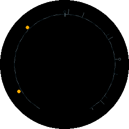
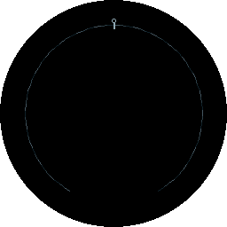
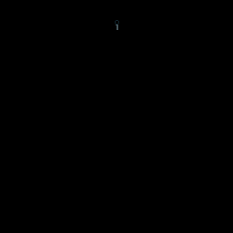
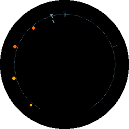
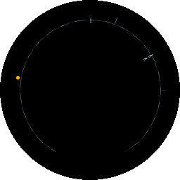
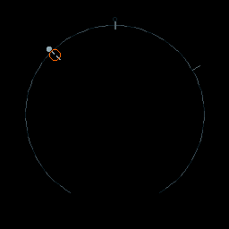
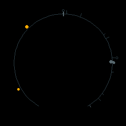
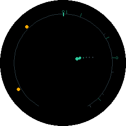
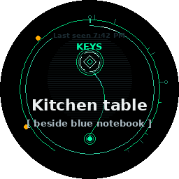
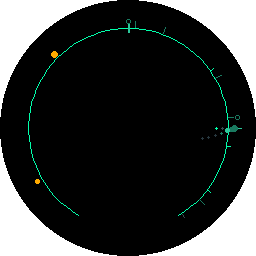

# The glasses experience

The Halo display is a small round waveguide. DreamLayer's founding rendering
decision — the Meridian thesis — is that this display is **a place, not a
stage**: it is never blank, cards do not "pop up," and every pixel that moves
carries information. This chapter walks the experience end to end; the
[card gallery](hud-cards.md) and [design language](meridian.md) chapters go
deeper on each piece.

## The Horizon — the resting state

When nothing needs you, the glasses show the **Horizon**: a 72-segment ring
that is your day, drawn as a track of light. Events, commitments, and echoes
of the past sit at their angle of the day; a notch heartbeat breathes at now.
The rim is not decoration — reading the ring *is* reading your calendar.

| The day, idle | The Veil down |
|---|---|
|  |  |

*Both frames are rendered by the actual device Lua through the raster
harness — these are the pixels the firmware produces.*

When you put the glasses on (or the host sends `wake`), the day assembles
radially from the notch over 600 ms, and the idle **aurora** begins: a 12
second luma wave that flows light along the day's track using the palette
hardware, at zero additional draw cost.

Promises you have made live on the Horizon too, as an arc ladder; a broken one
shatters — once, at the transition, never again on replay.

| The promise ladder | A shattered promise |
|---|---|
|  |  |

## How a card arrives — focus physics

Cards do not appear; they **condense**. Each card type has a home angle on the
Horizon (recall cards are stamped with an `origin_deg` derived from the
memory's timestamp), and the card flies inward from that point on the rim: an
anticipation pull-back past the rim, squash-and-stretch on the flight head
(never on text), a phosphor tail cooling behind it, and a spring "click" on
the landing ring. When dismissed, the card **recedes** home — the light files
itself back into the day.

| Condensing | Holding (confidence ring) | Receding |
|---|---|---|
|  |  |  |

The hold ring's color *is* the answer's confidence; a one-shot glint runs the
confidence arc as it settles, and the settled frame is a static gauge — no
idle spectacle.

## Priorities and the queue

The device state machine (`halo-lua/app/state_machine.lua`, queue in
`main.lua`) classes every card:

- **URGENT** — hark, privacy, errors: preempts what is showing.
- **CONTEXT** — recalls, dossiers, fact-checks, captions: queued politely.
- **AMBIENT** — palette shifts, dream weather: never interrupts.

A crossfade between an outgoing and incoming card is bounded by the material
rules (panes draw only at `exit_t == 0`), so the worst composited frame stays
inside the measured draw budget of 420 calls.

## Input — buttons and head gestures

The Halo has a button and an IMU. The state machine maps the button by
context: from ready, **single click** opens listening (ask), **long press**
slams the Privacy Veil; on a showing card, **single or double click**
dismisses; from the veil, **long press** resumes. **Double tap** enters and
leaves Dream Mode.

The IMU gesture classifier (`halo-lua/app/imu_gesture.lua`) recognizes five
head gestures from accelerometer peaks, each with a confidence and a shared
900 ms cooldown:

| Gesture | Motion | Confidence | Meaning |
|---|---|---|---|
| `NOD_SAVE` | one down-up nod | 0.90 | save this moment |
| `DOUBLE_NOD` | two nods | 0.92 | strong confirm |
| `SHAKE_DISMISS` | three alternating shakes | 0.88 | dismiss / no |
| `GLANCE_PEEK` | quick upward glance (under 350 ms) | 0.82 | peek |
| `TILT_REVEAL` | held tilt (over 400 ms) | 0.85 | reveal more |

**Seam:** on real hardware these classify live `frame.imu_data()`; in the
repo they are exercised by tests feeding synthetic accelerometer traces.

## Sound and touch

Every significant moment has a matched earcon and haptic, chosen host-side and
carried on the card payload: the wake chirp when Oracle starts listening, the
"Listen!" and "Watch out!" hark tones, the look cue when a dossier surfaces,
the neutral chime on a verified claim. Answer-ahead is deliberately silent —
its whole point is not to interrupt. The full map, including the audio files
that ship in the phone app, is in [Earcons and haptics](reference/earcons.md).
**Seam:** the speaker/actuator that plays them; the device Lua draws matching
visual "acoustics" (chime ring, chord arpeggio, pre-slam rumble) today.

## Dream Mode

Double-tap and the display steps through a door: a starfield streaks outward,
and the glasses stop being an assistant and become an instrument. Dream Mode
renders through its own path (`halo-lua/display/dream_renderer.lua`): the
Ghost Layer surfaces **WorldAnchorCards** — pale "MEMORY ECHO" text pinned to
places, drawn at 20 percent opacity with a per-character Perlin ghost-wake —
and **Synesthesia** turns what the camera and microphone sense into a
six-word poetic phrase with a gestural three-shape sprite. Inner Weather tints
the whole sky with your own climate. Double-tap again and the starfield pulls
you home. See [the wider lens set](lenses.md#dream-mode-and-the-night) for the
full Dream, REM, and Yesterlight story.

## What the glasses never do

The firmware contains no audio recording path, no face database, and no
network stack of its own — it can only reach the world through the paired
phone. Text never moves or distorts (a standing Meridian rule), privacy-class
cards render with no translucent pane and enter with a hard slam rather than a
pretty fade, and when the Privacy Veil lands, parallax freezes to zero on that
exact frame: nothing about the veil is allowed to feel ambient.
