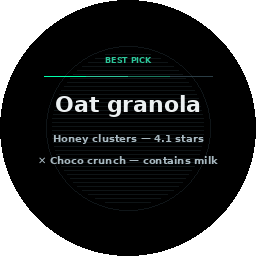

# A day with DreamLayer

The best way to understand the product is to walk through a day wearing it.
Every image below is the real interface.

## Morning

You put the glasses on. The display assembles a thin ring of light — that
ring *is* your day. Your meetings sit around it like hours on a clock face,
and a soft pulse marks now. Before you have asked anything, your morning
brief is floating there:

Two warm sentences: what is coming, what you missed overnight, what you owe
people. It fades on its own. The glasses then do what they do most of the
time: almost nothing. The resting display is just that quiet ring.

## Asking for things

Say **"Hey Oracle"** — or just tap the glasses — and it listens for the next
twenty seconds, so you can talk naturally without repeating the wake word:

"Where did I leave the bike?" "What did Marcus say he needed?" "Remind me to
call the plumber." "Focus mode." It answers in a calm sentence or two, and if
it does not know, it says so — it never makes things up. The full list of
what you can say is in [Talking to it](talking-to-oracle.md).

## In conversation

This is where DreamLayer earns its keep. While you talk with people, it can:

**Show live captions** of what is being said, quietly at the edge:

**Remind you who someone is.** You glance at a person you have met before
and their name, your history, and the last thing they told you appears:

**Catch your promises.** You say "I'll send you the lease by Friday" — it
heard that, and now it is tracked. No typing, no app:

**Hand you the answer** when someone asks the room a question you should
know:

**Check the facts.** If a claim contradicts what that same person told you
before, or does not survive a quick check, you see it — quietly, just you:

## Looking at the world

The look itself is a command. Glance at a form and ask "how do I fill this
out?" — every field, spelled out. Glance at dense small print and say
"explain this" — plain words. A question on a page: "what's the answer?"
Stand at a shelf or a menu and the pick appears with its reasons — anything
that breaks your dietary rules flagged, never hidden. When a look could
mean two things, a small chooser offers both; your tap teaches it your
preference for next time.

## Through the day

- Walk away from your bike and it taps you on the shoulder: *"You're leaving
  your bike."* One line, one sound, gone.
- "Set a timer for five minutes" — it runs on the glasses themselves, even
  with your phone in another room.
- Arrive somewhere that holds a memory and the memory arrives with you —
  "you left the charger here."
- Eight minutes before you need to leave for a meeting, it says so.
- Save any moment worth keeping with a small nod. A check mark blooms — the
  one little celebration in the whole interface:

## When you need quiet

Say "Hey Oracle, focus mode" and the interruptions stop — no cards, no
captions, no pop-ups — for twenty-five minutes, while it keeps remembering
in the background. Only a genuine emergency ("you must leave *now*") is
allowed through.

Need real privacy, not just quiet? Hold the button. The glasses go fully
deaf and blind — a shield fills the screen and *nothing* is seen, heard, or
kept until you hold it again. More in [Your privacy](privacy.md).

## Evening

Ask it to **rewind your day** and scrub back through your moments, on the
glasses or in the phone app:

At night, on the charger, it tidies up: consolidating what mattered, letting
go of what did not, so tomorrow's ring starts fresh. There is even a rank
and achievements system — the **Saga** — that marks your journey with it,
from Sleeper to Architect of Memory, if you enjoy that sort of thing.
