# What just appeared on my glasses?

Everything DreamLayer shows you is a **card**: a small round panel that
slides in from the edge of your day-ring, stays a few seconds, and files
itself away. Cards never stack, never nag, and never cover your view — one
at a time, most important first.

This is the glance guide: what each card means and why it showed up. (The
engineering-level detail on every card lives in
[the technical gallery](../hud-cards.md).)

## The everyday ones

| | |
|---|---|
| 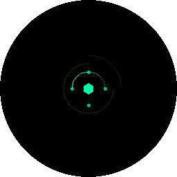 | **The quiet mark.** The glasses are on and *not* listening. This is what "idle" looks like. |
| 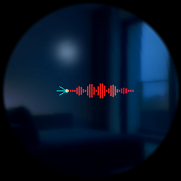 | **It's listening.** You woke the Oracle; the bars move with your voice. |
| 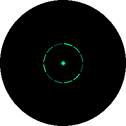 | **Thinking.** Your question is being answered. |
| 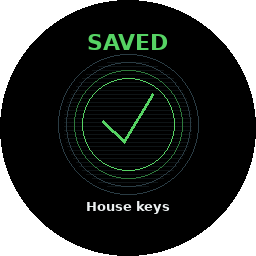 | **Kept.** The moment you just saved is safely remembered. |
| 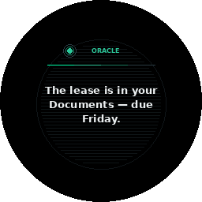 | **The Oracle answering** you, or confirming something it just did. |

## Memory coming back to you

| | |
|---|---|
| 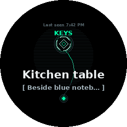 | **Where your thing is.** The little map shows you (the dot at the bottom), the place, and the object — with how sure it is and when it last saw it. |
| 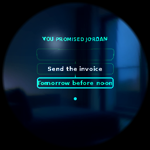 | **A promise.** Who, what, and when — either one you asked about, or one it just heard you make. |
| 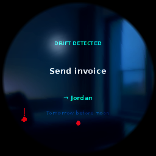 | **A promise slipping.** The bar on the left is draining; the promise is getting old. It surfaces before you break it, not after. |
| 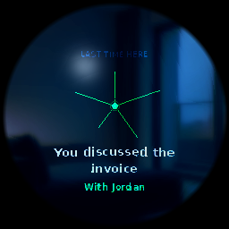 | **This place holds a memory.** You arrived somewhere, and something you left or noted here came back with you. |
| 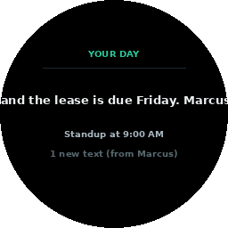 | **Your morning brief.** The day ahead, in two sentences. |
| 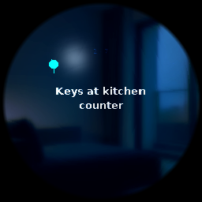 | **Rewinding.** One moment of your day; scrub back and forth through them. |

## People

| | |
|---|---|
| 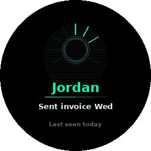 | **Someone you know is here.** Name, one line of why they matter right now ("owes you the lease"). |
| 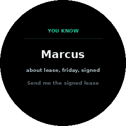 | **Your history with them.** When you last met and what you two tend to talk about. Only for people you chose to save — never strangers. |

## Conversation helpers

| | |
|---|---|
| 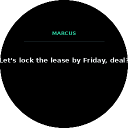 | **Live captions.** What was just said, written at the edge. |
| 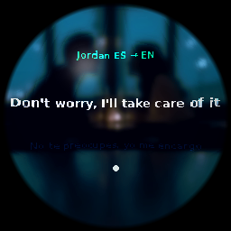 | **Translation.** Speech or text in another language, rendered in yours. |
| 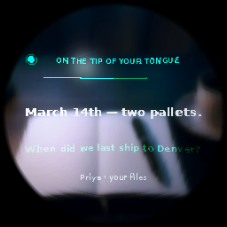 | **"On the tip of your tongue."** Someone asked a question; here is the answer, silently, for you to say. |
| 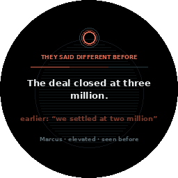 | **The fact-checker spoke.** Green means verified, amber means check this, red means they contradicted themselves. Full story in [The fact-checker](truth.md). |
| 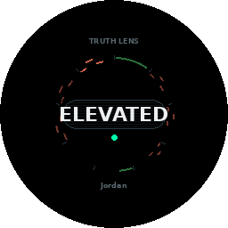 | **A read on delivery.** The ring shows how the analysis went around its nine steps — smooth arcs read as steady, torn gaps as strained. It only judges people it knows well. |
| 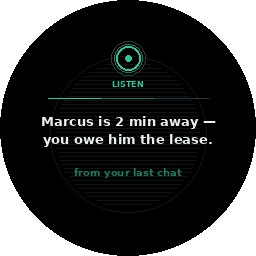 | **"Listen!" — a tap on the shoulder.** The one thing worth telling you right now: you are about to be late, you owe the person in front of you, you are walking away from your stuff. Amber means urgent. |

## Privacy — deliberately loud

These cards break the calm on purpose: no soft entrance, no gentle glow.
They slam in, because you should never be unsure about privacy.

| | |
|---|---|
| 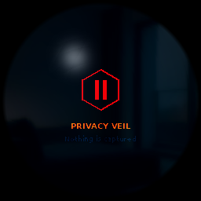 | **Fully off.** Deaf and blind until you hold the button again. |
| 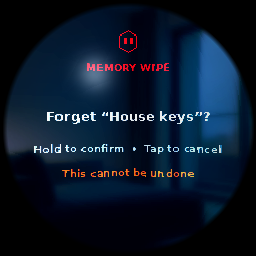 | **Forgotten.** The last capture is gone, as you asked. |
| 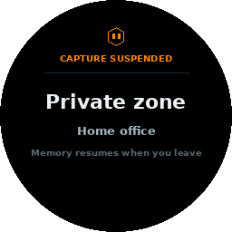 | **A no-record place.** You marked this place private; nothing records here. |
| 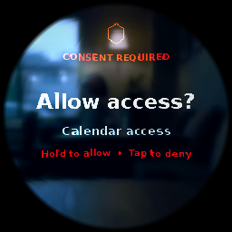 | **Your call.** Something new wants access; nothing proceeds until you say so. |

## The odd ones out

| | |
|---|---|
| 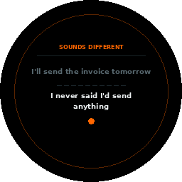 | **"That's not what you said before."** Your own plan changed — a gentle before-versus-now nudge. |
| 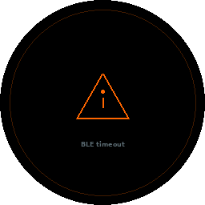 | **Something failed.** One plain sentence about what. |
|  | **An honest shrug.** It does not know, and it says so rather than guessing. |
| 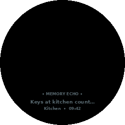 | **A memory echo.** In Dream Mode, a pale note pinned to the place you are standing. |
|  | **Dream Mode poetry.** Six words for what this moment feels like. Double-tap enters and leaves this mode. |
