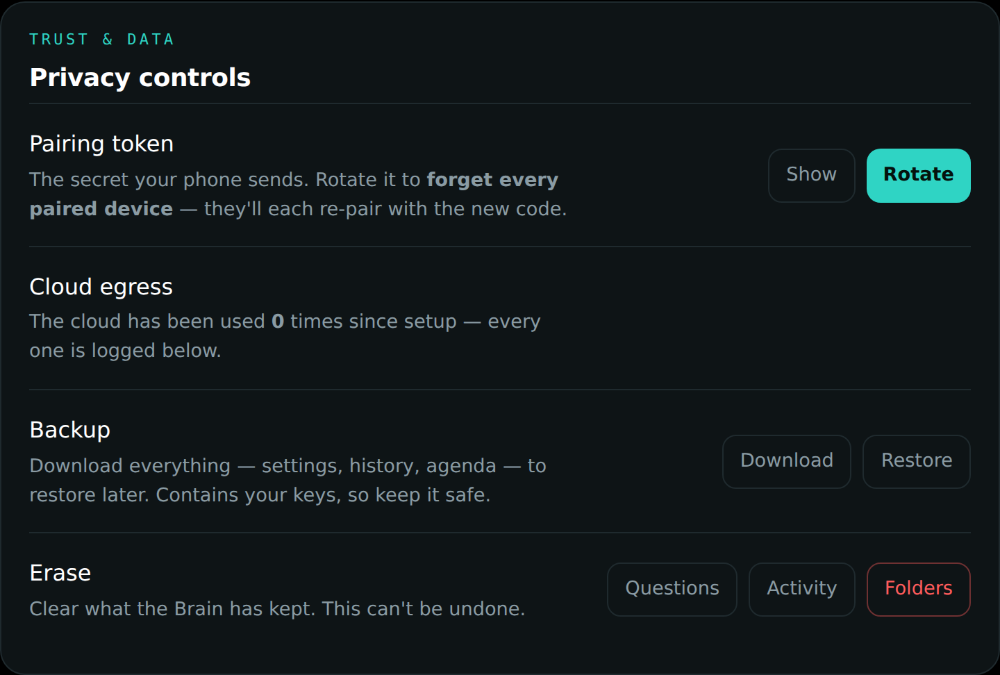

# Your privacy

Glasses that listen and remember are only acceptable if *you* hold the off
switch — physically, obviously, and everywhere at once. This chapter is the
plain-language contract.

## The one gesture that stops everything

**Hold the button.** The glasses go completely deaf and blind: no seeing, no
hearing, no remembering, no cards, nothing. A shield fills the display so
there is never any doubt about the state you are in. Hold again to come
back.

This is not a "mute" that some features ignore. Every single capability in
the product checks this one gate before doing anything.

## Three levels of quiet

People confuse these in every product; DreamLayer keeps them distinct:

| You want | Use | What happens |
|---|---|---|
| "Stop interrupting me" | **Focus mode** — "Hey Oracle, focus mode" | Cards, captions, and pop-ups pause for 25 minutes. It still remembers quietly. True emergencies still get through. |
| "Stop remembering for a while" | **Incognito** — "go incognito" | Nothing is kept, and the cloud is forced off, until you say "back on the record." |
| "Be off. Completely." | **The Veil** — hold the button | Deaf and blind. Nothing in, nothing out, nothing kept. |

## Where your data lives

Short version: **on your own devices, and it works that way by default.**

- Your memories, your people, your promises, and everything the Oracle has
  learned about you live on your phone and (if you added one) your Mac.
  The Mac reads your files *in place* on your own machine — nothing is
  uploaded to make search work.
- The **cloud switch** exists for one thing: rare, hard, general-knowledge
  questions that nothing in your home can answer. When it is off, the
  product simply says "nothing local matches" instead of reaching out.
- Even when cloud is **on**, your personal things — files, faces, people,
  memories, messages — are never what gets sent. And every single time
  anything does go out, it is counted and listed in plain sight on the Mac
  panel, so "how often does this thing phone home" has an exact, visible
  answer at all times.

## People — the hard line

- **It never identifies strangers.** There is no giant face database to
  search, by design — the capability simply does not exist in the product.
  It recognizes only people who introduced themselves to you and whom you
  deliberately chose to save.
- **Names are saved only with your say-so.** When someone says "Hi, I'm
  Maya," a card *offers* the name for a few seconds. If you do not confirm
  it, nothing is kept. Ever.
- **No recordings.** DreamLayer keeps meaning — "Maya mentioned the lease" —
  never audio or video of anyone.

## Everyday controls worth knowing

- **"Forget that."** Instantly erases the last thing it captured and shows
  you a confirmation card.
- **Private zones.** Mark a place as never-record; the glasses honor it
  automatically whenever you are there.
- **Nothing sends silently.** If you use it to reply to a message, you see
  the exact message and approve it first — the product physically cannot
  send without that approval.
- **Quiet hours.** Set a nightly window where the cloud is off on a
  schedule.
- **Erase and take-out.** The Mac panel can erase your history selectively,
  and can download a complete backup of everything it knows — your data is
  yours to take.

All the switches live together in the phone's Settings:

## What was deliberately not built

No stranger identification. No voice cloning. No covert recording modes.
These are not features waiting behind a setting — they were designed out of
the product on purpose.
