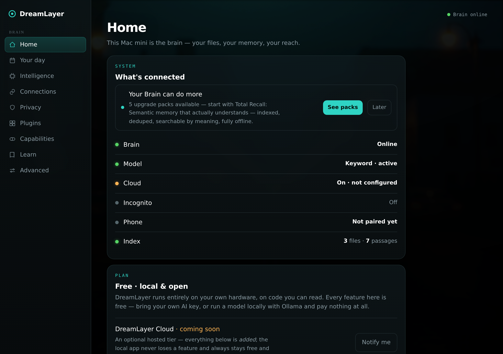
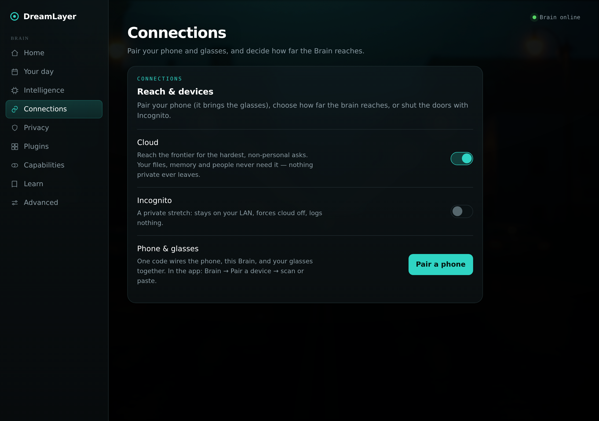

# Setting up

Everything pairs with one code. The whole setup is: install the phone app,
optionally set up the Mac, scan one QR code, put the glasses on.

## 1. The phone app

Install the DreamLayer app and open it. It starts on the **Brain** tab — the
home screen for your whole setup. A short welcome walks you through what the
product does and ends at pairing.

If you are skipping the Mac for now, you are already done: the phone is the
brain, and the glasses pair from this same screen. Everything core — memory,
people, promises, the Oracle — works right now.

**No hardware at all yet?** Tap **"Explore with sample data"** at the end of
the welcome. The whole app fills with clearly-labeled sample data — a
banner stays on screen the whole time so you can never mistake it for your
own life — and one tap exits.

## 2. The Mac (optional, recommended)

Adding an always-on Mac upgrades the brain: it can index folders you choose
(notes, documents, whatever you point it at), read your Messages and Mail if
you allow it, and answer questions from *your own stuff* — "what's the rent
on the lease?" gets answered from the actual lease file, on your own machine.

On the Mac, download the **DreamLayer app** (a normal Mac download — drag
it to Applications, double-click) from the site's Download for Mac button.
It lives quietly in your menu bar and opens its control panel in its own
window:

Three things worth doing on day one:

- **Choose folders.** Point it at the folders you want it to know — it reads
  them on your Mac and never uploads them anywhere.
- **Pick a model.** Out of the box it uses simple keyword search (works
  instantly, no downloads). One click upgrades it to a local AI model that
  writes proper answers — still entirely on your Mac.
- **Sync your calendar, contacts, and reminders** if you want the morning
  brief and people-memory to know about them.

## 3. Pair everything with one code

In the Mac panel's **Connections** view, press **Pair a phone** and a QR
code appears:

In the phone app: **Brain tab, Pair a device, scan**. That single code
connects your phone to your Mac and registers your glasses — one scan, done.
No accounts, no sign-ins; the code itself is the handshake, and it only works
for devices on your side of it.

## 4. Put the glasses on

The display wakes with a ring of light — that ring is your day. From here,
the [day-with guide](a-day-with-dreamlayer.md) shows what living with it is
like, and [Talking to it](talking-to-oracle.md) covers what you can say.

## The three switches

One idea worth learning at setup time: DreamLayer has no complicated modes,
just three independent switches, all on the Brain tab.

| Switch | Plainly | Starts as |
|---|---|---|
| **Mac** | "Use my Mac's bigger brain and my files" | Off — phone is the brain |
| **Cloud** | "For a rare hard question, ask the internet AI" | On — but easy to turn off, and it never gets your personal stuff |
| **Incognito** | "For the next stretch: remember nothing, and no cloud, period" | Off |

That is the entire mental model. The [privacy chapter](privacy.md) covers
what each one really means for your data.
