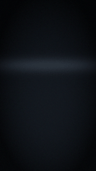

# Start here

DreamLayer is software for smart glasses that gives you a better memory and a
sharper ear. You wear the glasses through your normal day, and it quietly pays
attention on your behalf. When something matters — a promise you made, a name
you were told, a claim that does not add up, a meeting you are about to be
late for — a small card appears in the corner of your vision for a few
seconds, then gets out of the way.

That is the whole idea. It is not a phone screen strapped to your face. Most
of the time the display shows almost nothing at all.

## What it actually does for you

- **It remembers where you left things.** Ask "where did I leave my keys?"
  and it tells you: kitchen table, 7:42 this morning.
- **It remembers people for you.** When you meet someone again, it can quietly
  remind you of their name, when you last spoke, and what you talked about.
  Only people who introduced themselves to you and whom you chose to save —
  it will never identify a stranger.
- **It keeps your promises visible.** Say "I'll send you the lease by Friday"
  out loud, and it tracks that. As Friday gets close, it reminds you before
  you drop it.
- **It checks facts as people talk.** If someone tells you the deal closed at
  three million and they said two million last week, a quiet card lets you
  know. This is the flagship feature, and it is deliberately cautious — more
  on that in [The fact-checker](truth.md).
- **It hands you answers.** When someone in the room asks "what was our Q3
  number again?", the answer can appear on your glass before you speak —
  silently, so nothing interrupts the conversation.
- **It reads what is in front of you.** A form: every field spelled out. A
  question: answered. Dense small print: put in plain words. A shelf or a
  menu: the best pick, with reasons, and anything that breaks your dietary
  rules flagged.
- **It briefs you in the morning.** Put the glasses on and today is already
  there: what is coming, what you missed, what you owe.
- **It is extendable.** A community plugin store
  ([dreamlayer.app/plugins](https://dreamlayer.app/plugins.html)) adds
  things like live currency conversion on price tags — each plugin
  showing exactly what it is allowed to do before you install it.
- **It shuts up when you want.** One long press and the glasses go completely
  deaf and blind — nothing seen, heard, or kept — until you turn them back
  on. Privacy is a physical gesture, not a buried setting.

## What you need

| Piece | What it is | Required? |
|---|---|---|
| **The glasses** | Brilliant Labs Halo smart glasses — the display and the senses | Yes |
| **Your phone** | The DreamLayer app — the brain and the remote control | Yes |
| **A Mac** | An optional always-on Mac (a Mac mini is ideal) that adds "ask about my files and email" powers | No — everything core works without it |
| **The cloud** | An optional switch for the rare, hard question nothing in your home can answer | No — and off means off |

Your phone is the brain by default. Everything about your life — your
memories, your people, your promises — stays on hardware you own. The
[privacy chapter](privacy.md) explains exactly what can and cannot leave.

## Where to go next

- [Setting up](setup.md) — get everything paired in a few minutes.
- [A day with DreamLayer](a-day-with-dreamlayer.md) — what it is actually
  like to wear it.
- [What just appeared on my glasses?](cards.md) — the glance guide to every
  card.

*A note on honesty: DreamLayer is pre-hardware today. All the software you
will read about is built and working — every picture in this guide is
produced by the real product — but shipping glasses are still ahead. Where
something needs the physical hardware to finish the loop, this guide says so
plainly.*
