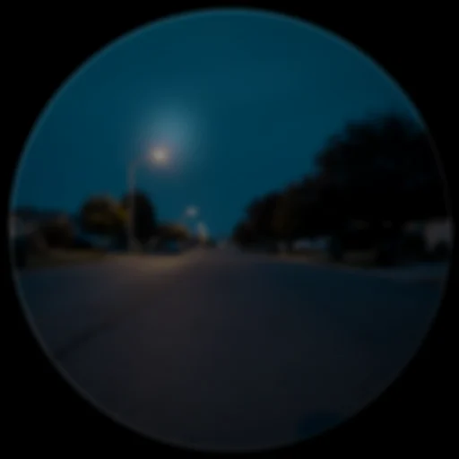
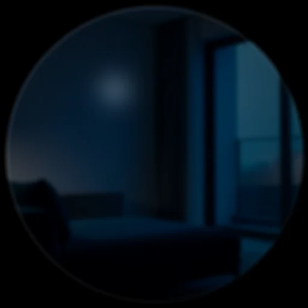
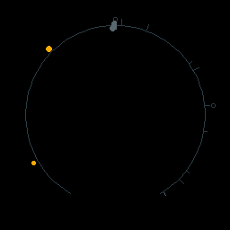
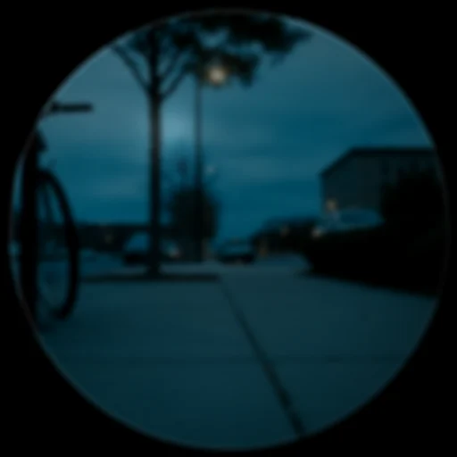
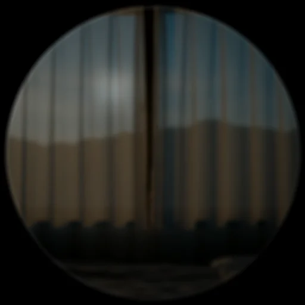
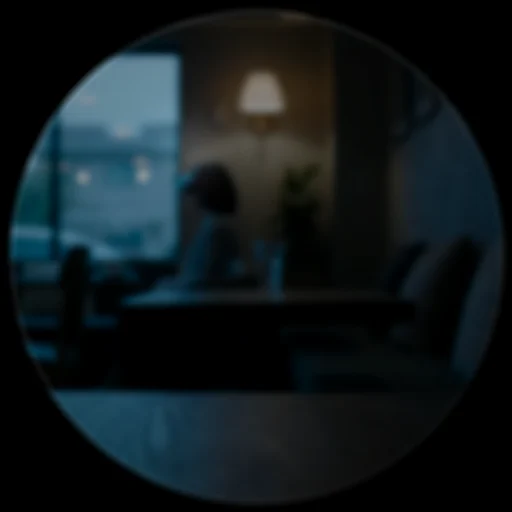
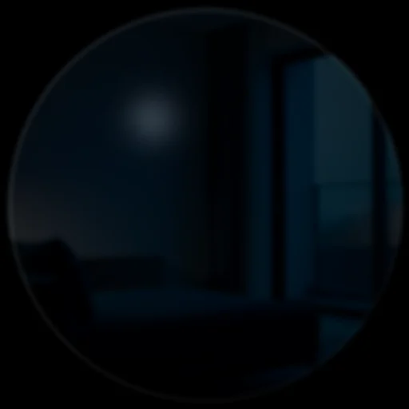

# HUD cards — the full gallery

Every card DreamLayer can put on the glass, rendered by the product's own
renderer. Card payloads are plain dicts built by
`host-python/src/dreamlayer/hud/cards.py`; the device draws them with
`halo-lua/display/renderer.lua`, and a pixel-mirrored Python renderer
(`hud/renderer.py`) drives these stills and the demo pipeline.
**Thirty-three card types have bespoke device-Lua renderers today**, and a
structural safety net guarantees the rest: any card type without a bespoke
draw routes through its layout table or a minimal titled fallback — no
card, present or future, can ever render a black frame on the glass. No
card is mirror-only anymore.

Each entry lists: when the card appears, what it shows, its materials
([Solid](meridian.md#solid--the-material-system)) and motion
([Lumen](meridian.md#lumen--motion-and-living-light)), and how it leaves.
"Dismiss" is the auto-dismiss time in milliseconds (0 = stays until acted on).

## Resting and system

### ReadyCard

- **Appears:** on boot, on `show_ready`, on resume from the veil, on connect.
- **Shows:** the calm mark — a memory-trace core inside gradient rings with
  satellite dots. No text; it means "I am here and not listening."
- **Materials/motion:** gradient arc rings (`RAMP_MEMORY`), staggered layer
  condense.

### QueryListeningCard

- **Appears:** single click, or "Hey Juno" — the ask posture.
- **Shows:** a cardioid microphone glyph over a 32-bar waveform. With live
  `amp` frames from the host (~15 bytes, capture-time only) the bars track
  your actual voice through the palette's voice slot; without them the
  waveform self-runs exactly as before.
- **Dismiss:** on result.

### ListeningCard

- **Appears:** the moment Juno wakes, from any enabled source — voice
  ("Hey Juno"), tap, gaze, raise, or gesture. Shown only if visual wake
  feedback is on.
- **Shows:** a pulsing ring plus the wake source; carries earcon `wake` and
  haptic `tick` on the payload (each independently toggleable).

### LoadingCard

- **Appears:** while a tier is thinking.
- **Shows:** three ghost rings and 12 static segments. Nothing rotates — a
  palette chase walks light around the segments at the old spinner's RPM
  (900 ms), so reduced-motion users get a clean static ring instead of a
  frozen spinner.

### ErrorCard

- **Appears:** on a failure worth telling you about ("BLE timeout").
- **Shows:** an amber triangle and one plain sentence. The attention ring
  draws as a single calm sweep — no flashing.
- **Dismiss:** 4000.

### LowConfidenceCard

- **Appears:** when recall has nothing above threshold.
- **Shows:** "Not sure" in ghost ink. DreamLayer says *I don't know* rather
  than guessing.
- **Dismiss:** 3000.

## Memory

### SavedMemoryCard

- **Appears:** the instant a moment is kept — a scene ingested, a
  conversation captured, a nod-to-save.
- **Shows:** a giant double-struck check inside concentric gradient rings over
  a soft glass pane; SAVED in hero type.
- **Motion:** the check draws on with a soft spring, a chime ring expands
  (220 ms), and a 12-particle burst fires at hold — the one small celebration
  in the system.
- **Dismiss:** 1200.

### ObjectRecallCard

- **Appears:** "where did I leave my keys?" — object recall.
- **Shows:** a spatial scene, not a list: the place as a translucent field,
  the object as a layered diamond jewel with orbit arcs and bloom, you as a
  dot at the bottom, and a continuous gradient trace connecting the two (dim
  at you, bright at the thing). Jewel hue encodes confidence; footer carries
  last-seen time.
- **Motion:** the `conduct` flair — a light wave flows along the trace from
  place to object every 2.4 s.
- **Dismiss:** 3500.

### CommitmentRecallCard

- **Appears:** when a promise is recalled — or the moment one is captured
  from your own speech ("I'll send you the lease by Friday").
- **Shows:** who, what, when as three chain links; the live link is a glowing
  glass capsule with gradient connectors.
- **Motion:** the chain forges link by link on snappy springs.
- **Dismiss:** 4000.

### CommitmentDriftCard

- **Appears:** when a tracked promise starts to slip
  (`orchestrator.tick_drift`).
- **Shows:** the task with a decay rail on the left — the live bar is
  confidence times (1 - decay); urgency shifts amber to danger at decay 0.6.
- **Motion:** a slow idle pulse on the confidence dot (600 ms sine).
- **Dismiss:** 4500.

### ProactiveMemoryCard

- **Appears:** you arrive somewhere that holds a memory (`on_place`).
- **Shows:** the remembered context under a five-ray radial field with a
  bloomed tip.
- **Dismiss:** 3500.

### WorldAnchorCard

- **Appears:** in Dream Mode, when the Ghost Layer finds a memory pinned to
  where you are standing.
- **Shows:** a pale MEMORY ECHO — deliberately at 20 percent opacity, the
  faintest thing the system draws.
- **Motion:** Ghost-Wake — each character wakes with per-character Perlin
  jitter over 320 ms. Renders through the dream path
  (`dream_renderer.lua`).
- **Dismiss:** 8000.

### TimeScrubNodeCard

- **Appears:** rewind — "Hey Juno, rewind my day," or the phone's Rewind
  screen's on-glass twin. One card per moment as you scrub.
- **Shows:** a horizontal timeline of the day; the current node enlarged with
  bloom and a tick, neighbours as ghost labels, position ("3 of 11") in the
  eyebrow.
- **Motion:** the node dot springs between positions (`ease_out_expo`).
  **Seam:** the twist/tap gesture that drives `scrub("back"|"forward")`.
- **Dismiss:** 0 — you are driving.

### MorningBriefCard

- **Appears:** the moment the Halo goes on in the morning
  (`orchestrator.wake` fetches the Brain scheduler's latest brief).
- **Shows:** two warm sentences and up to a few bullets: what is coming, what
  you missed, what you owe.
- **Dismiss:** 8000.

## People

### PersonContextCard

- **Appears:** someone you know is in view (anticipation person cue).
- **Shows:** name in hero type, one why-line ("owes you the lease"),
  a headline, an avatar ring with bloom under an enlarged crown, and a
  12-segment familiarity ring.
- **Motion:** a three-arc chord arpeggio (40 ms steps) when an avatar is
  present.
- **Dismiss:** 3500.

The Solid recomposition sample (`person_context_v2`) shows the same card as a
centerpiece:

### PersonDossierCard

- **Appears:** you greet — or look at — someone the conversation ledger
  knows (`greet`, `look_at_person`). Carries earcon `look`.
- **Shows:** the conversation dossier: last seen, recurring topics between
  you, and their most recent line.
- **Dismiss:** 5000.

## Conversation and truth

### SpokenCaptionCard

- **Appears:** every line of speech while live captions are on
  (`ingest_caption`); the ledger keeps recording even when the display is
  toggled off.
- **Shows:** speaker and line, quietly, at the rim.
- **Dismiss:** replaced by the next line.

### LiveCaptionCard

- **Appears:** translated speech — Puente (the ear) or Rosetta reading text
  aloud in your language.
- **Shows:** original and translation, a language pill, a confidence dot.

### FactCheckCard — Veritas

- **Appears:** a claim someone made failed (or passed) the live fact-check.
  See [Truth and discernment](truth.md) for exactly when Veritas speaks.
- **Shows:** the claim in hero type under a verdict eyebrow, the basis line
  ("earlier: 'we settled at two million'"), and a Discernment footer
  ("Marcus - elevated - seen before"). Verdict tone is resolved on-device
  (`card_tone` / `FACT_COLOR`), so a wire-delivered card always carries its
  color: green VERIFIED, amber CHECK THIS, red THEY SAID DIFFERENT BEFORE,
  ghost UNVERIFIED.
- **Motion:** the status ring springs in snappily; disputed and
  self-contradiction verdicts fire one 420 ms pulse. Earcons: chime /
  hark_urgent / hark by verdict; double haptic on the two flagging verdicts.
- **Dismiss:** 7000.

The device-Lua render of the same card:

### AnswerAheadCard

- **Appears:** someone else asked a real, answerable question and the copilot
  pre-fetched the answer ("ON THE TIP OF YOUR TONGUE").
- **Shows:** the answer in hero type, the question cooled beneath it, source
  in the footer.
- **Sound:** none — silent by design; a tick haptic only.
- **Dismiss:** 8000.

### JunoReplyCard

- **Appears:** Juno answered you (kind `answer`) or did something for
  you (kind `action` — "Focus on — the world's turned down.").
- **Shows:** the reply in Juno's voice under a JUNO eyebrow with a
  bloomed cue dot; success ramp for actions, memory ramp for answers.
- **Dismiss:** 6000.

### HarkCard

- **Appears:** the attention policy decided *this moment* is worth
  interrupting you: "Listen!" (a commitment about to slip, someone you owe in
  view, something you are walking away from) or an urgent "Watch out!" (you
  must leave now).
- **Shows:** the one-line clue in hero type inside a LISTEN ring — amber for
  urgent, memory-teal otherwise.
- **Motion:** the ring breathes on hold (1100 ms; 700 ms when urgent).
  Earcon `hark` / `hark_urgent`, tick / double haptic, flash on urgent.
- **Dismiss:** 6500.

### TruthLensCard — the testimony thread

- **Appears:** a Truth Lens delivery read completed on a calibrated speaker.
- **Shows:** the nine analysis stages as a 360-degree testimony thread — each
  stage a 40-degree slot at radius 64: truthful reads draw as a continuous
  success arc, deceptive ones as a torn three-dash break. Only the newest
  stage is bright; older testimony cools to its dim twin, so temporal order is
  visible. The verdict sits in a glass capsule; the stranger case renders
  "insufficient baseline" rather than a verdict.
- **Motion:** a ripple entry, stages accumulate at 80 ms per stage, torn
  stages spit three deterministic shards, and one glint runs the settled
  thread.

| Clean truthful read (device Lua) | Elevated, mixed read (device Lua) |
|---|---|
|  |  |

### DeviationAlertCard

- **Appears:** the Tell engine noticed new speech contradicting a prior
  commitment (`tell_check`).
- **Shows:** what was said before versus now across a dashed divider, with a
  severity dot.
- **Motion:** an idle ripple ring every 2.4 s, dimmed honestly through the fx
  palette slot.
- **Dismiss:** 5000.

## Privacy

Privacy-class cards share hard rules: no translucent pane, a slam entry with
a 100 ms full-field rumble dim, and a hard-cut exit — no graceful recede, no
origin mark left on the Horizon. Nothing about privacy is allowed to feel
ambient. They stay up until you act (dismiss 0).

### PrivacyVeilCard

- **Appears:** long press — the veil lands. Capture, pop-ups, anticipation:
  everything stops.
- **Shows:** shield and pause bars. Parallax freezes to zero this exact frame.

### ForgetLastCard

- **Appears:** "forget that" — confirming the last capture was erased.

### PrivateZoneCard

- **Appears:** you entered a place you marked as never-record.

### ConsentRequiredCard

- **Appears:** a new data source wants in; nothing proceeds without a
  deliberate confirm.

## Dream Mode

### SynesthesiaCard

- **Appears:** in Dream Mode — the VLM's six-word poetic read of what the
  senses feel like right now.
- **Dismiss:** 4000.

The v2 form adds a dominant color and a gestural three-shape sprite:

## The once-missing frames

**UpcomingCard** ("leave in 8 min", dismiss 6000 — warms to amber inside
five minutes), **HereCard** ("your bike is here", 5000), and **MessageCard**
(an incoming text or email, 6000) gained bespoke device renderers in the
missing-frames pass, so the anticipation and message engines now land on
the glass as designed. **PaletteShiftCard** is
not a card at all on the wire: the device consumes it as a palette command
(mood tint), which is why it is deliberately absent from the sample gallery.
Other modules carry their own cards (QuestCard and QuestRewardCard from the
Saga, SocialLensCard, IntroOfferCard, ConsistencyCard from Candor, provenance
and waypath panels) — see the [card catalog reference](reference/cards.md)
for the complete constructor table.

Two newer host-emitted types ride the safety net rather than a bespoke
renderer: **CandorCard** (the [Candor Mirror](lenses.md#truths-siblings)
debrief — "How you spoke") and **WaypathCard** (the direction/place
answer). They draw through the layout path — legible by construction,
never black — and are candidates for bespoke treatment when their designs
settle.
