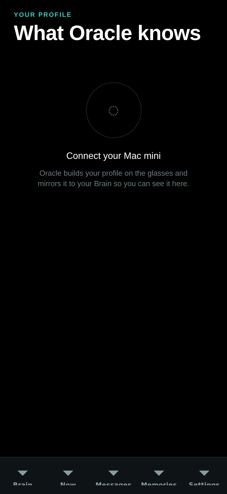

# Juno

Juno is DreamLayer's voice: the thing you wake, ask, command, and — over
time — the thing that learns how to address you. It lives in the orchestrator
(`orchestrator/orchestrator.py`, grammar in `orchestrator/voice.py` and
`orchestrator/commands.py`, voice and manner in `orchestrator/persona.py`).

## Juno, embodied

Juno now has a face — a small animated character (teal hair, four
iridescent wings, a glowing orb ringed by memory glyphs) who appears in
three places: floating behind the landing page's hero, greeting you on
the phone app's first onboarding step, and resting in the corner of the
Mac panel.

One clip serves all three surfaces (a 10-second, 20 fps idle loop as a
true-alpha animated WebP; the phone ships the identical bytes), and it
degrades deliberately: reduced-motion swaps in a still, small panel
windows hide her entirely, and mobile drops the shimmer and parallax for
a cheap translate-only float. She is always decorative — marked hidden to
screen readers, never intercepting a tap.

One honesty note, because this book runs on the product's own standard:
**Juno's character clip is brand art, not interface output.** It was
produced by an external AI video/matting pipeline, not by the renderer
that draws everything else in this book, and it is never presented as
something the glasses display. The interface rule stands untouched; the
character is the product's mascot, labeled as such here.

## Waking it

Four wake sources, each independently toggleable (`set_wake_source`, mirrored
by the phone's Settings screen):

- **Voice** — a leading wake phrase. The grammar accepts *hey juno*,
  *ok/okay juno*, *juno*, *hey dreamlayer*, *ok dreamlayer*, and
  *dreamlayer*, only as the first token of the line — "the juno said so"
  mid-sentence does not wake it. **Seam:** the on-device ASR and acoustic
  wake-word spotting that produce the text.
- **Tap**, **gaze**, **raise** — hands-free wakes via `activate(source)`.
  **Seam:** the physical tap/gaze/raise signals.

On wake, three kinds of feedback fire, each independently toggleable
(`set_wake_feedback`): a visual **ListeningCard** ring, the `wake` earcon,
and a `tick` haptic.

### Continuous conversation

A wake opens a **20-second session** (`juno_session_s`). Inside it,
follow-ups need no wake word — `hear(text)` treats any line as addressed to
Juno, and each command extends the window. Outside the window,
non-addressed lines are ignored (they still flow to captions and the ledger
if those are on).

## What "Hey Juno" can do

`ask_juno` dispatches in strict order: an explicit **teach** first, then a
**device command**, then a **knowledge intent**.

### 1. Teaches — "call me Sam"

`UserModel.learn` catches explicit instruction before anything else:

- **Names:** "call me Sam", "my name is Sam", "name's Sam" — pronouns and
  digits are rejected as names.
- **Preferences:** "I prefer aisle seats", "remember that I ...",
  "note that I ...", "I always / usually / hate / avoid / can't stand ..." —
  normalized to first person, capped at 120 characters, at most 40 kept.

A teach is confirmed in Juno's own voice ("Good to know you, Sam." /
"Got it — I'll remember that.") and pushed to the paired Brain immediately.

### 2. Device commands

Parsed by a closed grammar (`commands.py`); each returns an
**JunoReplyCard** of kind `action` with a themed confirmation:

| Say | Command | Effect | Confirmation |
|---|---|---|---|
| "focus mode" / "turn off focus" | `focus` | `set_focus(25)` / `clear_focus()` | "Focus on — the world's turned down." / "Focus off. I'll speak up again." |
| "go incognito" / "off the record" / "go dark" | `incognito` | `set_incognito` | "Incognito. Nothing's being kept." / "Back on the record." |
| "captions on/off" / "subtitles" | `captions` | `set_captions` | "Captions on." / "Captions off." |
| "keep watch" / "proactive off" | `proactive` | `set_attention` + `set_anticipation` | "I'll keep watch." / "I'll stay quiet unless you ask." |
| "cloud on/off" | `cloud` | `use_cloud` | "Cloud on — I can reach further now." / "Cloud off. Everything stays with you." |
| "rewind" / "replay my day" | `rewind` | `rewind_scrub()` — the scrub opens on glass | "Rewinding your day." |
| "what's my rank / level / saga" | `saga` | confirmation; the phone completes it against the Brain | "Here's how far you've come." |
| "sync my calendar / contacts / reminders" | `sync` | confirmation; executed on the Brain | "Syncing your calendar." |
| "remind me to ..." / "add an event ..." | `remind` | confirmation; captured toward the agenda | "Noted — call the plumber." |

Off-cues (off, stop, end, disable, exit, cancel, pause, hide, quiet) flip any
toggleable command the other way.

### 3. Timers, intervals, and the clock — no Brain required

Say *"set a timer for five minutes"*, *"interval timer, 30 on, 15 off, 8
rounds"*, *"show a clock"*, or *"what time is it"* and Juno builds the
behavior on the spot: each becomes a budget-verified Reality Compiler
figment deployed straight to the glasses' stage. Two execution paths, same
grammar (`voice.py: _parse_timer_clock`): with a paired Brain the figment is
compiled there (and pruned from the vault afterward — timers never clutter
the Repertoire); **with no Brain at all, the hub compiles and deploys it
directly over BLE** — no vault, no HTTP, fully offline. Hold the button to
stop early; *"cancel the timer"* works too. Deliberately ephemeral: nothing
persists. Veil-gated. (Tests: `test_native_timers.py`,
`test_hub_offline.py`.)

### 4. People, spoken

The social memory is voice-first (`voice.py`; full detail in
[Perception and memory](perception-memory.md#the-social-memory-spoken)):

| Say | Intent | Effect |
|---|---|---|
| "remember Maya's into rock climbing" / "note that she works at Google" | `note_person` | a note on that person (by name, or whoever you looked at in the last 90 s) |
| "this is my brother Dan" / "meet my colleague Sarah, she runs marketing" | `meet_person` | keeps them on the spot — face if one is in view, relationship and note attached |
| "Marcus owes me $20" / "I owe Dana lunch" | `debt` | a debt line on their card |
| "Marcus paid me back" / "we're even with Dana" | `debt_settle` | clears it — "Squared up with Marcus." |

All veil-gated ("Not while you're incognito."), all confirmed in-voice, all
mirrored to the phone's People tab. The same intents work **typed** from the
phone through `POST /dreamlayer/voice`, so the pocket and the glasses share
one grammar.

### 5. Scholar, spoken

*"What's the answer"*, *"how do I fill this out"*, *"explain this"* route to
the [Scholar lens](world-lenses.md) — and saying one arms the next look for
6 seconds, so "explain this" followed by a glance at the page goes straight
to plain words with no chooser.

### 6. Things, stashed and found

Tell Juno where you left something, then ask later — answered
entirely from your own **Waypath anchors**, no Brain required:

| Say | Intent | What happens |
|---|---|---|
| "I left my bike at the north rack" / "my car's in the garage" / "I'm parked on level 3" | `stash` | drops a Waypath anchor — "Got it — your bike is at the north rack." |
| "where's my bike?" / "where did I park?" | `locate` | answers from that anchor and draws the direction/place card on the glass |

The stash grammar (`voice.py: _parse_stash`) is deliberately past-tense
and thing-shaped: only *left / put / stashed / dropped / stowed / set*
(plus the parked forms) parse, and person, event, time, and idiom subjects
are refused — so "I'm leaving at nine" and "my mom is in the hospital"
degrade safely to a plain ask instead of becoming a bogus anchor. The two
halves are gated differently on purpose: incognito refuses the write ("Not
while you're incognito.") but a read of your own anchors still answers —
incognito blocks keeping, not recalling. Only the full Veil (capture
paused) holds the on-glass answer too. A thing you never stashed
gets the honest miss: "I don't have a spot saved for your bike yet."
More on the anchors themselves in
[Perception and memory](perception-memory.md#stashes-and-the-waypath).

### 7. Hold that thought — Stasis

Interrupted mid-task? Say *"hold that thought"* (or double-nod) and
Stasis freezes the moment — the last thing you were saying, held
**verbatim**, with where you were and what you were looking at. Coming
back, say *"where was I"* / *"what was I saying"* (or tilt), or simply
return to the same place or object, and it offers you back your own cues
— never a summary, never a finished sentence, no model in the loop.
Full detail in [the lens set](lenses.md).

### 8. Knowledge intents

Anything else runs through `parse_intent` (`voice.py`) and `handle_voice` —
and since the wiring pass, every one of these completes end to end instead
of returning a bare intent:

| Intent | Example | What happens |
|---|---|---|
| `recall` | "what did Marcus say he needs?" | routed through the brain (`ask_brain`) |
| `reply` | "reply to Priya saying on my way" | the Brain stages the reply — drafting a line if you gave none — and the send still requires explicit approval |
| `brief` | "brief me" / "what's my day" | pulls the morning brief |
| `missed` | "what did I miss?" | the Brain counts genuinely missed texts and emails and says so ("You missed 2 texts and 1 email.") |
| `ask` | anything else | the tiered brain — device, then Mac mini, then cloud if enabled |

Answers come back framed by the persona; when nothing is known Juno
says so plainly: *"I don't have that one — want me to look further?"* — it
never invents.

## The persona

`persona.py` fixes the voice: calm, perceptive, warm; one or two plain
sentences; never overclaiming ("never invent facts; if you're not sure, say
so" is written into the persona prompt used for LLM-backed replies). The
greeting adapts to what it knows: "I'm here, Sam." once you have told it your
name — `juno_greeting()` uses `UserModel.address()`.

## How it learns you — the user model

`orchestrator/user_model.py` builds a deliberately small, private profile,
entirely on-device:

- **What it keeps:** the topics you return to (keyword counts from *your own*
  lines only — stopword-filtered, capped at 300 with pruning), who you talk
  with most (name counts), your explicit preferences (up to 40), what to call
  you, and a running observation count.
- **What it never keeps:** raw audio, other people's words as your interests,
  anything while the Privacy Veil is down (learning rides on `ingest_caption`
  and `ask_juno`, both veil-gated).
- **Persistence:** a single JSON file, `usermodel.json`, beside the memory
  vault; purely in-memory for ephemeral sessions.

### The hub-to-Brain profile bridge

`publish_profile` POSTs the snapshot to the paired Brain
(`POST /dreamlayer/profile`) — debounced to every 10 observations, immediate
on an explicit teach. The Brain **mirrors** it (`profile.json`,
`GET /dreamlayer/profile`) and never authors it; it also caps what it will
store (name, up to 12 interests, 12 people, 40 preferences, the observation
count). The phone renders the mirror on the Profile screen — "What Juno
knows about you" — so the model is always inspectable:

*The live phone screen. With no Brain paired it shows its empty state; the
profile fills as Juno observes and as you teach it.*
