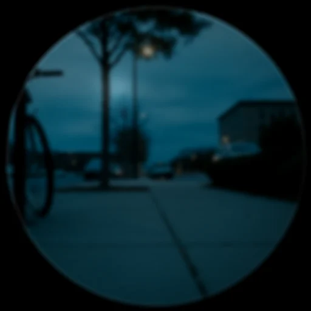
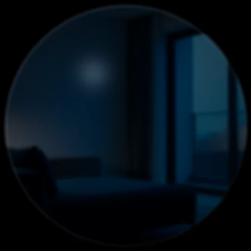

# The six lenses and the wider set

Everything DreamLayer does groups into six **lenses** — the product's mental
model, kept *in code* as a registry (`host-python/src/dreamlayer/lenses.py`,
with `all_features`, `find_feature`, and `lens_of` so the taxonomy is
queryable). Two things run underneath all of them: the **Privacy Veil** (the
spine) and **Atmosphere** (the ambient light: Inner Weather, the Prism Lens,
Palette Cycling).

| Lens | For | Features |
|---|---|---|
| **Memory** | your life, remembered | Dream Mode, Ghost Layer, Lucid Recall, REM, Yesterlight, Premonition, Waypath |
| **People** | who is around you | Social Lens, Timbre, Name Capture |
| **Truth** | what is true and where beliefs come from | Truth Lens, Candor, Provenance |
| **World** | understand what you look at | Juno (look-to-know), Label Lens, AI Brain, Rosetta, Puente |
| **Life** | do, keep, and build | Commitment Drift, Saga, Reality Compiler |
| **Together** | two wearers, one sky | Confluence |

The core lenses have their own chapters ([Juno](juno.md),
[Perception and memory](perception-memory.md), [Truth](truth.md),
[Saga](progression.md), [Privacy](privacy.md)). This chapter covers the rest
of the set — each fully wired into the orchestrator, each with a design spec
under `docs/`.

## Dream Mode and the night

**Dream Mode** (`dream_mode/`, spec `docs/DREAM_MODE.md`) is the double-tap
world: the display steps through a starfield door and becomes an instrument
rather than an assistant. While dreaming, camera and IMU frames feed the
engine (`on_scene_frame`), the microphone FFT feeds it (`on_audio_frame`),
and two card families render through the dedicated dream path on the device:

- **Ghost Layer** — world-anchored memory echoes. Stand where a memory
  lives and a pale **WorldAnchorCard** wakes, character by character.
- **Synesthesia** — a poetic six-word read of what the senses feel like,
  with a dominant color and a gestural sprite.

**REM** (`rem/`, spec `docs/REM.md`) is the sleep cycle:
`maybe_dream_tonight(charging)` runs consolidation when the glasses charge at
night, gated by **NightWatch**. It dreams over the day's memories,
consolidates, produces a morning reel, and — the durable part — writes a
**RetrievalBias** the Horizon reads: what the night decided matters is
slightly brighter the next day.

**Yesterlight** (`docs/YESTERLIGHT.md`) folds yesterday's light back into
today's ring; **Premonition** (`docs/PREMONITION.md`) is the forward twin — a
`RecurrenceModel` sweeps for events that *usually* happen about now and
ghosts them onto the Horizon as breathing-dim dots (never brighter than the
real), hardening the model when a predicted event lands.

## Atmosphere

- **Inner Weather** (`docs/INNER_WEATHER.md`) — your own climate, made
  visible: dream-sky weather driven by your day's texture, rendered through
  the dynamic palette slots.

  

  | A quiet dream sky (device Lua) | An anchor echo in weather (device Lua) |
  |---|---|
  |  |  |

- **Prism Lens** (`docs/PRISM_LENS.md`) — the kaleidoscope, rebuilt in Lumen
  with spring bloom, breathing rotation, and counter-rotating halo rings,
  inside strict photosensitivity caps.
- **Palette Cycle** (`docs/PALETTE_CYCLE.md`) — slow ambient color flows
  through the leased slots (`display/palette_cycle.lua`).

## World — look at anything

- **Scholar** (`orchestrator/scholar.py`) — read the question and answer
  it, spell out a form's fields, or put dense text in plain words; and
  **TasteLens** (`orchestrator/taste.py`) — the shelf/menu choice engine
  with hard dietary vetoes and plugin data connectors. Both routed by the
  Glance Arbiter or voice; full chapter:
  [Scholar and TasteLens](world-lenses.md).
- **Object Lens / Juno-look** (`object_lens/`, specs `docs/OBJECT_LENS.md`)
  — `look_at_object(frame, facet=None|"own"|"ai"|"shop")` builds a
  contextual panel for the thing in view. Providers plug in per domain
  (an AI provider backed by the tiered brain, a label provider, Rosetta for
  text); integration seams exist for a laptop, a car, a plant. The lens never
  identifies people — `PERSON_LABELS` enforcement keeps humans in the Social
  Lens's consented domain.
- **Rosetta** (`rosetta.py`) is the **eye**: text you look at — a menu, a
  sign — OCR'd and translated (`translate_seen(text, target)`). **Puente**
  (`orchestrator/puente_bridge.py`) is the **ear**: real-time speech
  translation into LiveCaptionCards. Complementary by design; they share
  card styling, not pipelines. **Seams:** OCR, the translation model, and
  the microphone.
- **Waypath** (`find_way(subject, heading_deg)`) — point-me-to-my-things:
  a bearing card from your heading to where the remembered object lives.
- **Docent** (`docent(query)`) — a venue's own knowledge, answered on its
  premises from its published collection, offline; and **Rosetta Live**
  (`translate_heard`) — live speech translated on the glass, offline with
  the Argos pack — now riding a single named-slot figment rather than
  per-utterance caption cards. Both in
  [the World lenses chapter](world-lenses.md#docent--the-venue-speaks).
- **Thread** (`thread(image)`) — steal color from the world: the palette
  of whatever you look at, quantized to six named swatches and kept as a
  recallable memory. The image itself is never stored — only the swatches.
- **Retrace** (`retrace(subject)`) — "where did I last *see* it": recall
  from passive sightings, blended by confidence and recency
  ([Perception and memory](perception-memory.md#ask-and-receive--object-and-commitment-recall)).
- **Ember** (`ember()`) — the gentle anniversary layer, sensitive by
  design: at most **one** memory, only one you *chose to keep* (pinned),
  from about a year ago today — and it stays silent entirely when your
  inner weather reads storm. It is now the *afterglow* of the full Ember
  practice (`dreamlayer.ember`, docs/EMBER.md): tend a moment until it
  lives in you, burn the recording with explicit consent, and the cue-only
  tombstone left behind is exactly what this card resurfaces a year on —
  for you to answer from memory alone.
- **Stasis** (`stasis`, docs/STASIS.md) — save states for your mind. A
  double-nod (or *"hold that thought"*) freezes the moment you were
  interrupted — the last thing you were saying, held **verbatim** — and
  offers to put you back inside the doing when you return. It never
  summarizes and never finishes your sentence; it returns your own cues
  and trusts your cognition. No LLM in the loop, ever.

## Truth's siblings

- **Candor** (`check_consistency(claim)`, spec `docs/COMMITMENT_DRIFT.md`
  neighborhood) — the on-device self-consistency check: does this claim
  contradict what *you* have said and kept? Emits a ConsistencyCard; never
  touches the network. Veritas reuses its `contradicts` predicate for the
  speaker-against-themselves pass.
- **Provenance Lens** (`trace_provenance(claim)`, `docs/PROVENANCE_LENS.md`)
  — where did this belief come from? Traces a claim to its origins and
  standing in your own record; pairs with the `Answer.sources` attribution
  that every brain answer carries.
- **Candor Mirror** (`orchestrator/candor.py`) — the truth machinery,
  pointed inward. It listens only to *your own* lines: live speaking pace
  (a gentle nudge when you sustain past 165 wpm), a filler-word tally
  (hidden until you peek), and your own narrative drift folded in from the
  consistency check. The debrief card — eyebrow "How you spoke" — reads
  like: *"162 wpm (up), 9 'um's, and you told the project story
  differently than Tuesday."* Inward-only by construction, and the Veil
  silences it completely. The design point is written into the module: a
  deception pipeline pointed at others is a scandal; pointed at yourself
  it is a coach — and only an open codebase can prove which one it is.

## Life — building and keeping

- **Commitment Drift** (`docs/COMMITMENT_DRIFT.md`) — promises as physics:
  states run blooming, healthy, drifting, cracking, shattered;
  `nudge_commitment` / `keep_commitment` / `break_commitment` move them;
  `tick_drift` raises the drift card as decay grows. The Horizon draws the
  arc; a broken promise shatters exactly once.

  

- **Reality Compiler v2** (`reality_compiler/`, specs `docs/rc_v2/`) — the
  build-a-skill path: **Rehearsal** compiles a described procedure
  ("three rounds of two minutes, bell between") into a signed **Figment** —
  a budget-verified little program that runs *on the glass stage* with the
  button driving it. `build_skill(name, text)` is the orchestrator surface;
  the wire protocol has first-class figment put/swap/revoke/ack messages,
  and the phone's Rehearsal screen is now **live end to end** — every beat
  round-trips the Brain's `rc/*` endpoints (rehearse, keep, deploy, revoke),
  with deploys recording BLE envelopes until the glasses transport attaches.
  Juno also compiles **native timers, intervals, and a clock** through
  the same engine, on the spot, with or without a Brain
  ([Juno](juno.md#3-timers-intervals-and-the-clock--no-brain-required)).
  The five recorded sessions under `out/rc_v2/` (round timer, rolling
  rounds, spar night, a refused strobe — the safety path — and hot-swap
  revoke) are its executable spec, alongside `docs/rc_v2/echo.md`,
  `loom.md`, and `rehearsal.md`.

  The compiler now also **teaches itself**, three ways: **repertoire
  ranking** learns which kept figment you start where and when, and offers
  exactly one — "Gym timer — start the usual?"; **rehearsal refinement**
  notices the scene you keep banishing a figment at ("You end Rounds
  around 20:00 of 25:00 — every time.") and proposes a trimmed variant,
  which re-runs the whole budget-verify-and-sign path before it can
  deploy; and **grammar mining** counts the phrasings the parser keeps
  failing on, locally, so the closed grammar grows from real misses rather
  than guesses. The grammar itself grew too: **cadence scenes** (a slow
  breathing envelope in seconds — never a flicker), **place and presence
  events** (`place:enter`, a bonded partner's emit as your transition),
  IMU gestures, and **ledger emits** — a figment's taps recorded into a
  performance log you keep. And a kept figment can now carry a
  **dedication**: signed into its canonical bytes, an heirloom another
  device can inherit and prove came from you.

## Together — Confluence

**Confluence** (`confluence/`, spec `docs/CONFLUENCE.md`) is two wearers, one
sky: a consented **bond** entangles two Horizons; togetherness drifts and
settles as you move through the day apart or together. **TinCan** sends a
single tap down the wire as a gentle ping; **weather gifts** let one wearer
send the other a sky. The orchestrator surface is
`attach_confluence(bonds, sky)` / `receive_confluence(wire)` /
`outgoing_weather()`, with a tap collector feeding single-clicks while
dreaming. **Timbre** (`docs/TIMBRE.md`, People lens) gives known voices their
own audio texture. The phone's Confluence screen presents the bond
lifecycle; live two-device streaming is the pre-hardware seam.

The bond now scales to a group: **GhostMode mesh** entangles a whole circle
under one three-word code, and **The Beacon** finds your people in a crowd
by feel — bearings and distance bands, never coordinates. See
[The platform](platform.md#pillar-2--ghostmode-mesh-and-the-beacon).

## Lucid Recall — the query router

`lucid_recall/router.py` is the ask-and-receive front door: it classifies a
query (face keywords route to the Social Lens; fact keywords to the memory
index and the tiered brain) and returns one HUD card. The AI knowledge tier
folds into it — "ask about your own stuff" *is* Lucid Recall extended from
memory to your files and mail.

Once an unwired island (its memory index was, in the audit's own words,
"implemented nowhere"), it is now genuinely part of the orchestrator:
`orc.lucid_query(text, frame)` routes through a Retriever-backed index,
is recall-gated like every other read, and its classifier upgrades to a
dense semantic router when the semantic-recall extras are installed —
falling back byte-identically to the keyword path otherwise.

## The newer lenses

The lenses added in recent builds. Each card below is the real renderer's
output, shown through the glass — the interface is real; the world behind it is
illustrative.

| | |
|---|---|
|  | **Retrace** — where you last saw a thing, by place and time ("north rack, 8:12am"). Ambient-sighting recall; veil-gated. |
|  | **Ember** — spaced repetition for the moments you keep: an invitation to retrieve where it happened, then a flare when you reach and it's there. Detailed below. |
|  | **Docent** — a venue's own knowledge, grounded in a local collection and read from what you look at. |
|  | **Rosetta Live** — the ear: offline live translation, each utterance streamed into the named slots of a single on-stage figment. |
|  | **Candor Mirror** — the self-coach: after a conversation, your own pace, fillers, and narrative drift — never pointed at anyone else. |
|  | **Waypath** — "that way": one bright dot on a faint ring, a distance, and nothing else. No map app. |
|  | **Thread** — steal a palette from the light in a room and keep it as a memory (the image is never stored). |
|  | **Sous** — hands-free kitchen timers as on-glass figments: "flip in ninety," every pan its own clock. |
|  | **Session** — a musician's companion: tempo on the rim, pitch in the luma, a practice log that writes itself. |
|  | **Kiln** — an offline-total firing companion; the Brain absent by design, the log kept as a lab notebook. |
|  | **Stasis** — save states for your mind: a double-nod holds the exact thought you were interrupted in, verbatim, and puts you back inside it later. No summary, no LLM. |

### Ember — the four states of tending a memory

Ember is spaced repetition for the moments you *choose* to keep. The flame
grows as the memory takes hold — an invitation, a reward, a kind answer, and
finally consolidation:

| | |
|---|---|
|  | **Prompt** — the glow at the doorway: an invitation to retrieve, right where it happened. Walk on and it costs nothing — an unanswered prompt is *missed*, never a lapse. |
|  | **Flare** — you reached and it was there. One flare, gone in a breath; the reward is the recall itself, and the curve schedules the next glimpse. |
|  | **Reveal** — you reached and it wasn't there. The answer, gently — no score, no streak, no shame. The curve reschedules and forgetting stays kind. |
|  | **Graduated** — stability crossed the threshold: the moment lives in you now. The recording can be burned, with explicit consent; the memory stays. |

### Stasis — save states for your mind

Interrupted mid-thought? Three things die at once — what you were doing, the
half-formed idea, and where you stood. A **double-nod** (or *"hold that
thought"*) freezes all three: the ring buffer already holds your last minute of
thinking out loud, so the gesture costs zero words. Come back — tilt to settle
in, or say *"where was I"* — and the ribbon re-lights and offers your own words
back, ending on the dash your brain finishes:

