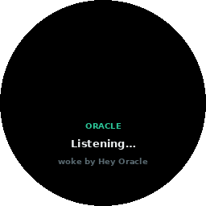

# The Oracle

The Oracle is DreamLayer's voice: the thing you wake, ask, command, and — over
time — the thing that learns how to address you. It lives in the orchestrator
(`orchestrator/orchestrator.py`, grammar in `orchestrator/voice.py` and
`orchestrator/commands.py`, voice and manner in `orchestrator/persona.py`).

## Waking it

Four wake sources, each independently toggleable (`set_wake_source`, mirrored
by the phone's Settings screen):

- **Voice** — a leading wake phrase. The grammar accepts *hey oracle*,
  *ok/okay oracle*, *oracle*, *hey dreamlayer*, *ok dreamlayer*, and
  *dreamlayer*, only as the first token of the line — "the oracle said so"
  mid-sentence does not wake it. **Seam:** the on-device ASR and acoustic
  wake-word spotting that produce the text.
- **Tap**, **gaze**, **raise** — hands-free wakes via `activate(source)`.
  **Seam:** the physical tap/gaze/raise signals.

On wake, three kinds of feedback fire, each independently toggleable
(`set_wake_feedback`): a visual **ListeningCard** ring, the `wake` earcon,
and a `tick` haptic.

### Continuous conversation

A wake opens a **20-second session** (`oracle_session_s`). Inside it,
follow-ups need no wake word — `hear(text)` treats any line as addressed to
the Oracle, and each command extends the window. Outside the window,
non-addressed lines are ignored (they still flow to captions and the ledger
if those are on).

## What "Hey Oracle" can do

`ask_oracle` dispatches in strict order: an explicit **teach** first, then a
**device command**, then a **knowledge intent**.

### 1. Teaches — "call me Sam"

`UserModel.learn` catches explicit instruction before anything else:

- **Names:** "call me Sam", "my name is Sam", "name's Sam" — pronouns and
  digits are rejected as names.
- **Preferences:** "I prefer aisle seats", "remember that I ...",
  "note that I ...", "I always / usually / hate / avoid / can't stand ..." —
  normalized to first person, capped at 120 characters, at most 40 kept.

A teach is confirmed in the Oracle's own voice ("Good to know you, Sam." /
"Got it — I'll remember that.") and pushed to the paired Brain immediately.

### 2. Device commands

Parsed by a closed grammar (`commands.py`); each returns an
**OracleReplyCard** of kind `action` with a themed confirmation:

| Say | Command | Effect | Confirmation |
|---|---|---|---|
| "focus mode" / "turn off focus" | `focus` | `set_focus(25)` / `clear_focus()` | "Focus on — the world's turned down." / "Focus off. I'll speak up again." |
| "go incognito" / "off the record" / "go dark" | `incognito` | `set_incognito` | "Incognito. Nothing's being kept." / "Back on the record." |
| "captions on/off" / "subtitles" | `captions` | `set_captions` | "Captions on." / "Captions off." |
| "keep watch" / "proactive off" | `proactive` | `set_attention` + `set_anticipation` | "I'll keep watch." / "I'll stay quiet unless you ask." |
| "cloud on/off" | `cloud` | `use_cloud` | "Cloud on — I can reach further now." / "Cloud off. Everything stays with you." |
| "rewind" / "replay my day" | `rewind` | `rewind_scrub()` — the scrub opens on glass | "Rewinding your day." |
| "what's my rank / level / saga" | `saga` | confirmation; the phone completes it against the Brain | "Here's how far you've come." |
| "sync my calendar / contacts / reminders" | `sync` | confirmation; executed on the Brain | "Syncing your calendar." |
| "remind me to ..." / "add an event ..." | `remind` | confirmation; captured toward the agenda | "Noted — call the plumber." |

Off-cues (off, stop, end, disable, exit, cancel, pause, hide, quiet) flip any
toggleable command the other way.

### 3. Knowledge intents

Anything else runs through `parse_intent` (`voice.py`) and `handle_voice`:

| Intent | Example | What happens |
|---|---|---|
| `locate` | "where did I leave my bike?" | object recall from memory |
| `recall` | "what did Marcus say he needs?" | routed through the brain (`ask_brain`) |
| `reply` | "reply to Priya saying on my way" | structured `{to, text}`; the phone/Brain complete the approved send |
| `brief` | "brief me" / "what's my day" | pulls the morning brief |
| `missed` | "what did I miss?" | the missed-items digest |
| `ask` | anything else | the tiered brain — device, then Mac mini, then cloud if enabled |

Answers come back framed by the persona; when nothing is known the Oracle
says so plainly: *"I don't have that one — want me to look further?"* — it
never invents.

## The persona

`persona.py` fixes the voice: calm, perceptive, warm; one or two plain
sentences; never overclaiming ("never invent facts; if you're not sure, say
so" is written into the persona prompt used for LLM-backed replies). The
greeting adapts to what it knows: "I'm here, Sam." once you have told it your
name — `oracle_greeting()` uses `UserModel.address()`.

## How it learns you — the user model

`orchestrator/user_model.py` builds a deliberately small, private profile,
entirely on-device:

- **What it keeps:** the topics you return to (keyword counts from *your own*
  lines only — stopword-filtered, capped at 300 with pruning), who you talk
  with most (name counts), your explicit preferences (up to 40), what to call
  you, and a running observation count.
- **What it never keeps:** raw audio, other people's words as your interests,
  anything while the Privacy Veil is down (learning rides on `ingest_caption`
  and `ask_oracle`, both veil-gated).
- **Persistence:** a single JSON file, `usermodel.json`, beside the memory
  vault; purely in-memory for ephemeral sessions.

### The hub-to-Brain profile bridge

`publish_profile` POSTs the snapshot to the paired Brain
(`POST /dreamlayer/profile`) — debounced to every 10 observations, immediate
on an explicit teach. The Brain **mirrors** it (`profile.json`,
`GET /dreamlayer/profile`) and never authors it; it also caps what it will
store (name, up to 12 interests, 12 people, 40 preferences, the observation
count). The phone renders the mirror on the Profile screen — "What Oracle
knows about you" — so the model is always inspectable:

*The live phone screen. With no Brain paired it shows its empty state; the
profile fills as the Oracle observes and as you teach it.*
