# The phone app

The phone app (`phone-app/`, Expo / React Native, TypeScript strict) is the
remote control and the pocket brain: pairing, the three switches, every
toggle, message approval, and a phone-sized view of everything the Brain
knows. Seven tabs — **Brain, Now, Look, Messages, People, Memories,
Settings** — plus hidden screens reached from Settings and Now (Brief,
Plugins, Waypath, Capabilities, Device Vitals, Feel, Ember, Rewind, Saga,
Profile, Rehearsal, Confluence, and the Cloud and Brain-tier views) and a
six-step onboarding.

*Every screenshot in this chapter is the real app: the repository's code
exported to web (`npx expo export --platform web`) and captured headlessly
at phone size, running in **Demo Mode** — the app's own labeled sample data
(see below), which is exactly what a new user sees when they tap "Explore
with sample data". Nothing is mocked up; the fixtures ship in the app.*

## Demo Mode — alive with no hardware

`enableDemo()` in the brain store flips one flag and the whole app fills:
every store getter serves labeled fixtures (`src/demo/fixtures.ts` — a
plausible day of briefs, people, memories, messages, saga progress, rewind
blocks) whenever `demoMode` is on, the glasses card shows a connected
`HALO-DEMO`, and a persistent **DemoBanner** sits at the top of every
screen with a one-tap exit, so sample data can never be mistaken for your
life. Fixtures use fixed timestamps — nothing is generated, nothing is
fetched. Exiting demo restores the honest empty states. It is reachable
from onboarding and from Settings.

## State: one store

`src/state/useBrainStore.ts` (Zustand) is the source of truth for
connections and toggles; three sibling stores carry the newer surfaces —
`usePeopleStore` (the social memory), `usePluginStore` (the plugin store;
the phone never runs plugin code, it posts install intent to the paired
Brain), and `useRehearsalStore` (the live Reality Compiler bridge). The
brain store holds:
connection state for the Mac mini (URL, token, relay URL) and glasses, the
three switches, and every toggle. A whitelisted snapshot persists to
AsyncStorage under the key `dreamlayer.brain.v1` and rehydrates on launch.
Two derived reads keep the UI honest: `brainKind()` ("phone" until a Mac is
connected) and `effectiveCloud()` (always false while incognito).

Server calls go through `brainFetch`: try the LAN URL from pairing; on
failure, fall back to the relay URL if one was paired. **Seam:** the relay
itself — host any secure tunnel to the Brain and put its URL in the pairing
bundle; the client already prefers LAN and falls back. Setting the cloud or
incognito switch also syncs the Brain (`POST /dreamlayer/config` with
`cloud_enabled` / `network_mode`), so phone and panel never disagree.

Three newer pieces make that connection honest under real-world networks:

- **One connection truth** (`src/state/useConnectionStore.ts`) — a single
  reachability store with four states and four plain labels: "Brain:
  home", "Brain: away — via relay", "Brain: unreachable — still
  remembering locally", "No Brain paired". Two consecutive probe failures
  flip it offline; one success recovers it instantly.
- **The config outbox** — a settings change that cannot reach the Brain is
  merged, persisted, and kept as *pending sync* (never silently dropped);
  the moment the connection store sees a recovery, the outbox drains.
- **Offline caches** — the Memories and People stores hydrate from their
  last-known snapshots on launch, so the app shows what it knew before any
  network round-trip.

## Brain — the hub tab

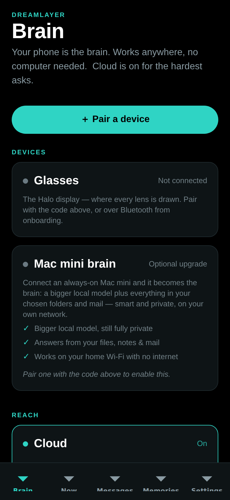

The first tab in the bar, and the home for your setup (day to day, a cold
launch lands on **Now**):

- **Pair a device** — scan the panel's QR (expo-camera, with a paste
  fallback) or paste the `dreamlayer:` code; one code wires Mac mini and
  glasses at once, with success haptics.
- **Devices** — Glasses (status, forget) and Mac mini (status, its three
  benefit bullets, connect/disconnect — "Use phone as brain instead").
- **Reach** — the Cloud switch, disabled while incognito.
- **Privacy** — Incognito and Pause memory capture.
- **Ask your brain** — a query box straight to `POST /dreamlayer/brain/ask`,
  rendering the answer with its tier.
- **Upcoming** (when a Mac is connected) — agenda from the Brain, calendar
  sync button, quick add.
- **Recent activity** (when connected) — the first eight items of the
  unified feed.
- **What your brain can do** — the six-lens overview.

## Now — the live mirror

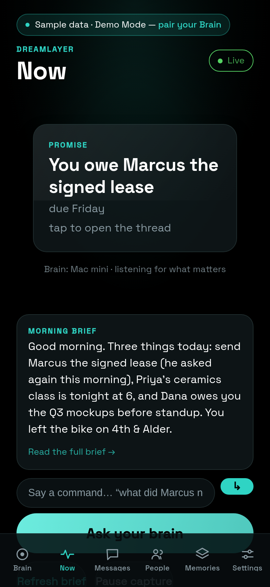

What the glasses are doing right now: a **HaloMirror** stage showing the last
card (or the paused state), a Live/Paused status pill, the latest morning
brief, a voice-command box that routes the same intents as Juno
(brief / answer / reply), and quick actions (brief, ask, pause/resume
capture). It polls `GET /dreamlayer/brief/latest` every 90 seconds and fires
a local notification when a genuinely new brief arrives.

## Look — the deliberate camera tier


New enough to have earned a tab: point the phone at anything and one
photo rides `POST /dreamlayer/brain/explain` — the same pipeline the
glasses use, with the answer stamped by the tier that produced it
("answered by: laptop"). The camera module loads lazily; no camera or no
permission degrades to an honest empty state ("No camera here"), never a
crash — which is exactly what the web export above shows.

## Messages — hands-free relay

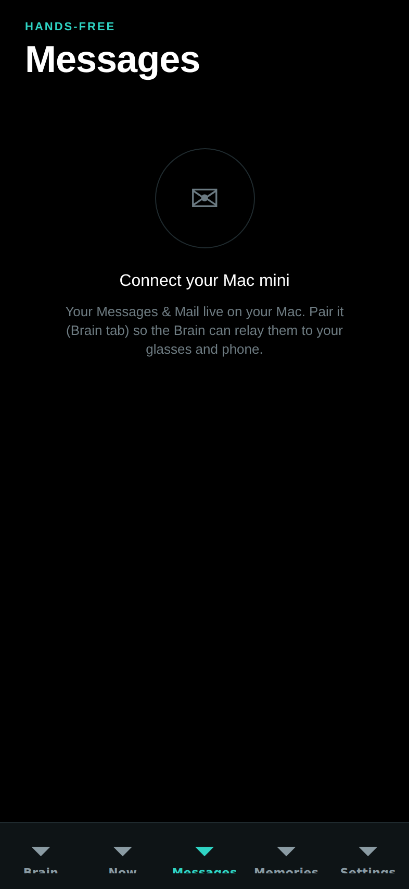

The Brain's Messages and Mail feed (12-second poll), with per-channel local
notifications. Tapping a message opens the reply pane: three AI-suggested
replies (`POST /dreamlayer/replies`) as tap-to-fill chips, then **Approve and
send** — which is the only send path, and it posts `approved: true`
explicitly. Gated empty states cover no-Mac, relay-off, and no-messages.

## People — your social memory

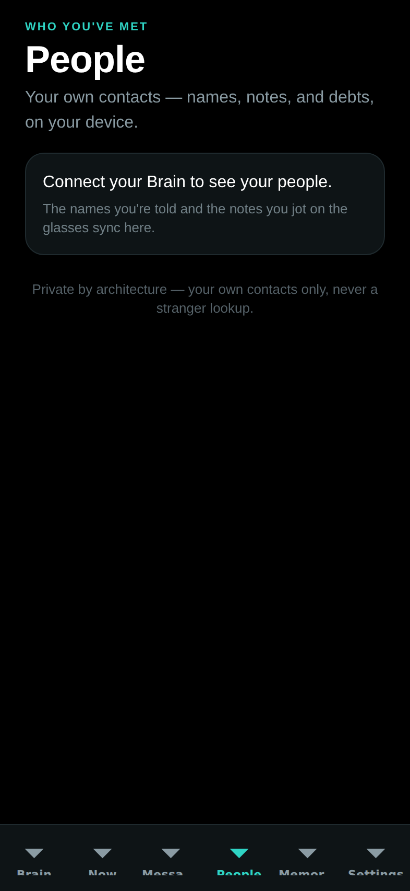

Everything the Social Lens knows, readable and editable: search across
names, relationships, and notes; per-person cards with the relationship
line, last seen, expandable notes (add or remove by hand), the topics you
two return to, and open debts in a coral box with a one-tap **Settle up**.
It reads the Brain's mirror (`GET /dreamlayer/social/people`) and edits
through `POST /dreamlayer/social/people/edit` — the same record the glasses
build when you say "this is my colleague Sarah" or "Marcus owes me $20".
The footer states the contract: your own contacts only, never a stranger
lookup.

## Memories — recall, grouped by day

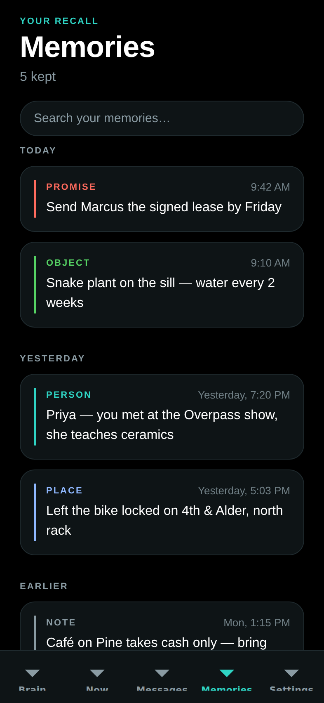

Today / Yesterday / Earlier groups, kind-colored (promise, person, object,
place, note), with local search — and now backed by the real thing: with a
Mac connected it pulls `GET /dreamlayer/memories`, the Brain's assembled
recall (saved places from Waypath, people met, owed favors, dated
reminders), merged with the local store. The search box gains a second
stage too: ask your files and mail, rendered as a "From your Brain" card
with sources.

## Settings — every toggle

| Privacy and relay | Juno |
|---|---|
| 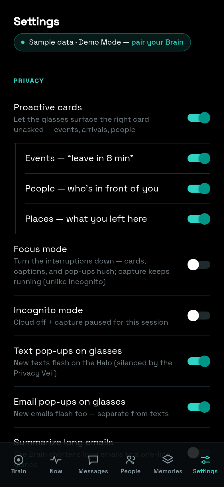 | 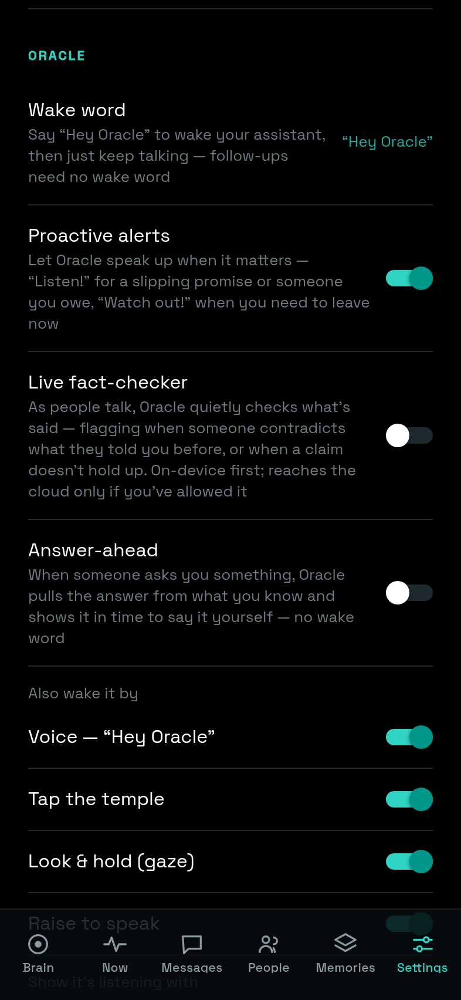 |

- **Privacy:** Proactive cards with nested Events / People / Places cues,
  Focus mode, Incognito, Text pop-ups, Email pop-ups, Summarize long emails,
  Pause memory capture.
- **Juno:** the wake word (fixed "Hey Juno" today), Proactive alerts,
  Live fact-checker (Veritas), Answer-ahead, wake sources (voice, tap, gaze,
  raise), and listening feedback (visual, audio, haptic).
- **Devices and brain:** glasses status and the link to the Brain tab.
- **Labs:** Saga, Profile, Rewind, Rehearsal, Confluence — joined by
  Waypath, Capabilities, Device Vitals, Feel, and **Ember** (the
  memories-you-tend practice; see [the lens set](lenses.md)), plus "What
  the cloud can see" and the live Brain tier ladder.
- **Explore:** the Demo Mode switch ("Explore the whole app with labeled
  sample data — no glasses or Mac needed").
- **Danger zone:** Erase all memories (confirmed) — it clears the local
  memory store *and* reaches the paired Brain
  (`POST /dreamlayer/memories/purge`), which drops every saved place while
  deliberately leaving people and reminders (they are mirrors of their own
  surfaces with their own remove controls). Erase now also clears the
  on-disk cache, so a purge can no longer un-delete itself on the next
  launch.

The full toggle-to-effect table, with defaults and the endpoints each drives,
is in [Settings and modes](reference/settings.md).

## Labs screens

| Rewind | Saga | Profile |
|---|---|---|
| 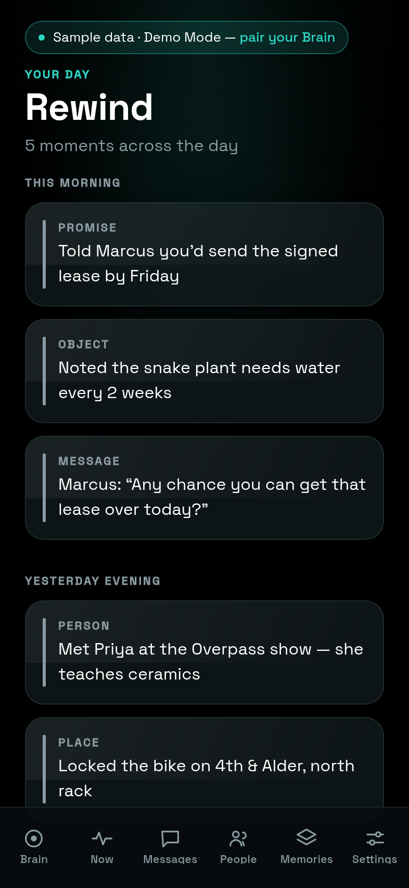 | 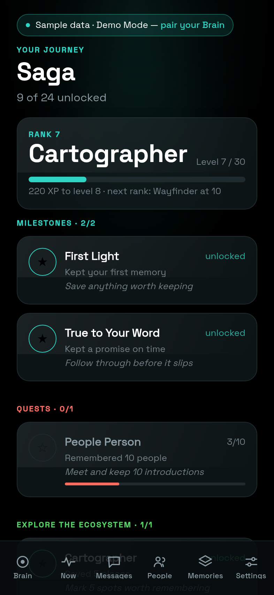 |  |

- **Rewind** — today's hour blocks from `GET /dreamlayer/rewind` (the same
  day the glasses scrub), color-coded by kind.
- **Saga** — rank, XP bar, and the achievement ledger; see
  [Progression](progression.md).
- **Profile** — "What Juno knows about you": the mirrored user model.

| Rehearsal | Confluence |
|---|---|
| 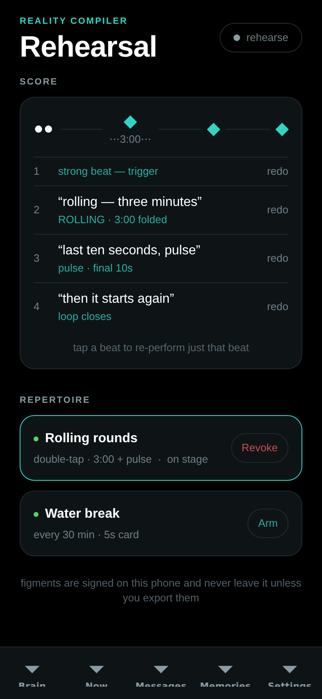 | 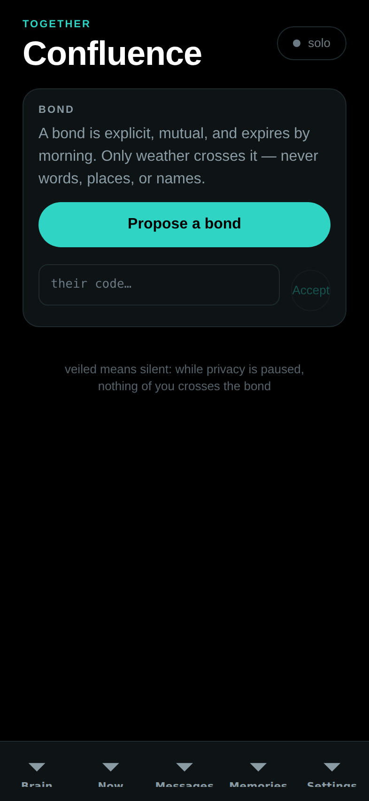 |

- **Rehearsal** — the Reality Compiler studio, now **live end to end**:
  every beat you perform (tap, double, hold, or a spoken beat via the
  keyboard's dictation) round-trips `POST /dreamlayer/rc/rehearse`, the
  score and budget proof render from the Brain's real reply, Keep signs the
  figment into the vault, and Arm / Revoke drive
  `rc/deploy` / `rc/revoke`. The remaining seam has narrowed: the whole
  loop — including a running lens talking back to the Brain — is closed
  and tested in TypeScript; what's left is the native BLE transport
  itself, so deploys record their exact envelopes until a Halo attaches.
- **Brief** — the extended morning brief, in sections (Today, Due, Waiting
  on you, Messages, Yesterday), composed on demand via
  `POST /dreamlayer/brief` with `depth: "long"` and stored to read offline.
  Reached from the Now tab's brief card.

  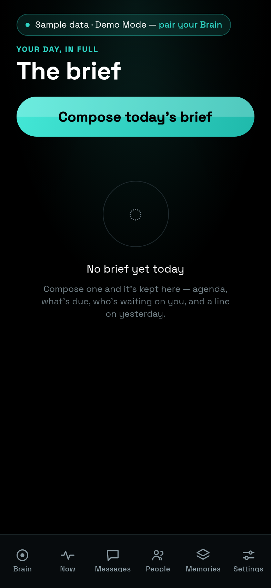

- **Plugins** — the store: browse and search the registry, Featured / Top
  rated / Downloads tabs, one-tap star ratings, and a permissions alert
  before any install. Installs are real now: the phone fetches the package
  and **sideloads** it to the paired Brain, surfacing the Brain's actual
  validation verdict; with no Brain paired the install queues locally and
  `flushPending` delivers it the moment one pairs. See
  [The platform](platform.md#the-store-in-three-places).
- **Confluence** — the bond lifecycle (propose, accept, live), togetherness,
  TinCan pings, weather gifts. Presentational until live bond streaming
  lands.

## The new Labs screens

| Waypath | Feel | Capabilities |
|---|---|---|
|  |  |  |

- **Waypath** — "one point of light — no map, no maps app." Enter (or use)
  your location and a destination; a real OSRM route (the default public
  server, self-hostable — the router URL is a swap-in seam) becomes a
  single dot on a ring plus a distance line ("28 m to the next turn"),
  bearing-corrected as you move. A **"Simulate the walk"** link ticks a
  fake GPS along the actual route so the whole screen is demoable at a
  desk — that is exactly how the screenshot above was taken.
- **Feel** — the earcon/haptic pack picker. Two bundled packs today
  (Glass, the default; Analog, weightier), applied app-wide and persisted;
  the footer states the contract: "Every pack passes the same sensory
  gate — patterns ≤400ms, the silent signal stays silent."
- **Capabilities** — the phone-sized view of
  [the capability report](integrations.md): what your paired Brain can
  also learn to do, sorted by impact, with the honest footer "the phone
  never installs code." Shown unpaired above — its real content needs a
  Mac on the LAN.
- **Device Vitals** — the audience for the glasses' TEL telemetry frames:
  heap now/peak with a text sparkline, crash and veil counts, cards
  shown/dismissed rates, figments banished. Empty ("No telemetry yet")
  until real glasses stream it — the honest pre-hardware state.
- **What the cloud can see** and **Brain — the tier ladder** — two small
  trust screens: the first renders `GET /dreamlayer/cloud` (see
  [DreamLayer Cloud](cloud.md)); the second renders
  `GET /dreamlayer/brain/tiers` — every tier with its measured latency and
  reliability, and a swap control. That ladder is the
  **Bring-Your-Own-Brain ceremony**: the moment a Mac joins, you *watch*
  answers get faster and richer, tier by tier.

## Onboarding

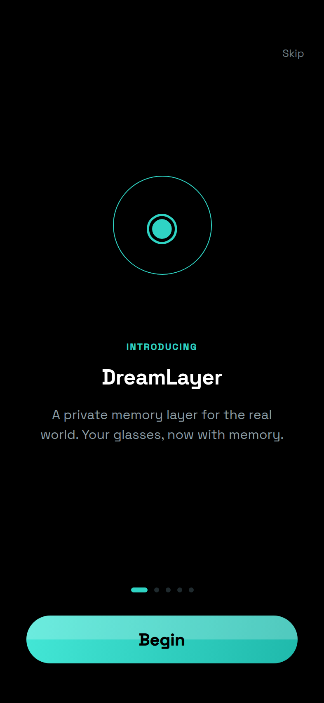

Six steps — welcome, how it works, recall, privacy, a try-the-camera look,
pair — with animated transitions, the pairing ring, and QR scan. Finishing
(or skipping) lands on the Now tab.

## Services and design system

- **Notifications** (`src/services/notify.ts`) — permission-memoized local
  pushes for new briefs and messages; silent no-op on web or without
  permission. **Seam:** on a real device, `expo-notifications` needs install
  permission granted.
- **Pairing codec** (`src/services/pairing.ts`) — the `dreamlayer:` code,
  byte-compatible with the Python implementation.
- **Earcons** (`src/services/sound.ts`) — the app ships the actual recorded
  clips (`assets/sounds/`: five "hey"/"hello" greetings, four listens, four
  watch-outs, three looks, two chimes) with variant rotation that never
  repeats back-to-back.
- **Haptics** (`src/services/haptics.ts`) — no longer four buzzes but a
  **data-driven vocabulary** of fourteen named signals (confirm, action,
  attention, interrupt, veil_on/veil_off ramps, commitment_crack and
  _bloom, truth_flag, figment_deployed — and answer_ahead, which is
  *silence by design*), every pattern at most ~400 ms, plus TinCan
  replaying the sender's actual tap rhythm. The full table is in
  [Earcons and haptics](reference/earcons.md#the-phone-haptic-vocabulary).
- **The BLE bridge** (`src/ble/`) — the glasses wire, in pure TypeScript:
  `framing.ts` is the 4-byte length-prefix protocol ported byte-for-byte
  from Python (pinned to Python-generated vectors), and `bridge.ts` is a
  transport-injected state machine — MTU chunking, streaming reassembly,
  reconnect backoff (0.5 s doubling to 8 s), and routing of inbound cards,
  figment acks, lens emits, and TEL telemetry. **Seam:** the native
  adapter (`transport.blePlx.ts`, react-native-ble-plx) loads lazily,
  returns null in Expo Go/web, and still carries placeholder service UUIDs
  marked for the bench — the real IDs need a Halo on a desk.
- **The lens relay** (`src/services/lensRelay.ts`) — closes the
  glass-to-Brain-to-glass loop: a running lens's rate-limited emit rides
  the bridge to `POST /dreamlayer/rc/emit` (an `ask` emit runs the Brain
  and pushes the answer back), and host text streams into the lens's slot
  via `rc/feed`. See [the Lens Builder](lens-builder.md#the-loop-glass-to-brain-and-back).

### Design system

`src/ui/` implements the DESIGN.md doctrine: dark and luminous (background
black, surface `#0E1416`, memory teal `#2FD4C4`, attention coral, one accent
per surface), an 8 pt spacing grid, a five-level type scale with an eyebrow
style, and motion tokens (180/240/400 ms, one standard ease) with
`useEntrance` fade-and-rise and `usePressScale` spring on every touchable.

The recent material overhaul raised the finish without touching the
doctrine: the whole app now sets in **Space Grotesk** (the brand face,
shared with the landing page; loaded via `@expo-google-fonts/space-grotesk`
with the weights mapped explicitly in `src/ui/theme/fonts.ts`, since custom
RN fonts ignore `fontWeight`), surfaces gained real depth through
`expo-blur` and `expo-linear-gradient` (the `CineBackdrop` ambient
gradient behind every screen), and the tab bar draws its own `TabIcon`
set instead of the platform defaults.

Primitives: `Screen`, `ScreenHeader`, `Card`, `Section`, `Tappable`,
`EmptyState`, `StatusPill`, `PillButton`, `ConnectorCard` with `SwitchRow`
and `Bullet`, `QrScanner`, `PrimaryButton`, `DemoBanner`, plus the
HUD-mirror components (`HaloMirror`, `CardPreview`, `DreamCanvas`,
`HorizonPreview`) that reuse the glasses' exact palette as QA truth.

## The App Store kit

The package now carries everything a store submission needs, checked into
the repo rather than living in someone's browser session:

- **fastlane** (`phone-app/fastlane/`): Appfile, Fastfile, and a
  Deliverfile driving `deliver`, with full metadata (name, subtitle,
  description, keywords, categories, review notes) under
  `fastlane/metadata/` in **nine locales** — en-US, de-DE, es-ES, fr-FR,
  it, ja, ko, pt-BR, zh-Hans — plus a screenshots directory in the layout
  `deliver` expects.
- **In-app i18n** (`src/i18n/`): the same nine languages — and no longer
  just the chrome: every tab screen's *body* is localized (placeholders,
  section labels, day groups, empty states, interpolated counts), a
  **catalog-parity gate** in the test suite fails the build if any locale
  drifts from the English key set or ships an empty string, and icon-only
  controls carry screen-reader labels.
- **Privacy:** every locale's `privacy_url.txt` points at the real policy,
  `https://dreamlayer.app/privacy.html`, served from the landing site in
  this repository.

## Running it

```bash
cd phone-app
npm install
npx expo start        # scan the QR with Expo Go (iOS/Android)
npx tsc --noEmit      # typecheck (strict)
npm test              # the phone's own test suite
```

The package finally has its own test suite: **Jest, run as two projects** —
"logic" (ts-jest over the pure-TS stores, services, BLE framing/bridge,
pairing) and "component" (jest-expo with React Native Testing Library over
the screens) — 119 test cases across 21 files at time of writing,
covering the framing parity vectors, the reconnect state machine, the
connection store's hysteresis, the outbox, Waypath geometry and routing,
the pack gate, and the new screens. `tsc --noEmit` remains the standing
typecheck, and the pairing codec's Python twin is still pinned by the
host suite.
