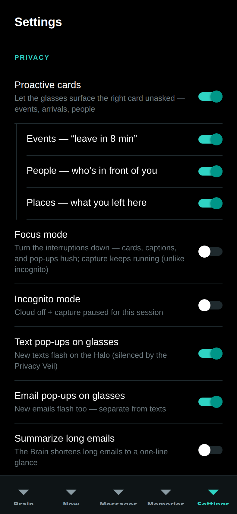

# The phone app

The phone app (`phone-app/`, Expo / React Native, TypeScript strict) is the
remote control and the pocket brain: pairing, the three switches, every
toggle, message approval, and a phone-sized view of everything the Brain
knows. Five tabs — **Brain, Now, Messages, Memories, Settings** — plus Labs
screens reached from Settings (Rewind, Saga, Profile, Rehearsal, Confluence)
and a five-step onboarding.

*Every screenshot in this chapter is the real app: the repository's code
exported to web (`npx expo export --platform web`) and captured headlessly at
phone size. Screens that need a paired Mac mini are shown in their honest
unpaired state — empty states are part of the design. The web export renders
the tab bar's default markers where native builds show icons; no `tabBarIcon`
is configured yet.*

## State: one store

`src/state/useBrainStore.ts` (Zustand) is the single source of truth:
connection state for the Mac mini (URL, token, relay URL) and glasses, the
three switches, and every toggle. A whitelisted snapshot persists to
AsyncStorage under the key `dreamlayer.brain.v1` and rehydrates on launch.
Two derived reads keep the UI honest: `brainKind()` ("phone" until a Mac is
connected) and `effectiveCloud()` (always false while incognito).

Server calls go through `brainFetch`: try the LAN URL from pairing; on
failure, fall back to the relay URL if one was paired. **Seam:** the relay
itself — host any secure tunnel to the Brain and put its URL in the pairing
bundle; the client already prefers LAN and falls back. Setting the cloud or
incognito switch also syncs the Brain (`POST /dreamlayer/config` with
`cloud_enabled` / `network_mode`), so phone and panel never disagree.

## Brain — the hub tab


The default landing tab:

- **Pair a device** — scan the panel's QR (expo-camera, with a paste
  fallback) or paste the `dreamlayer:` code; one code wires Mac mini and
  glasses at once, with success haptics.
- **Devices** — Glasses (status, forget) and Mac mini (status, its three
  benefit bullets, connect/disconnect — "Use phone as brain instead").
- **Reach** — the Cloud switch, disabled while incognito.
- **Privacy** — Incognito and Pause memory capture.
- **Ask your brain** — a query box straight to `POST /dreamlayer/brain/ask`,
  rendering the answer with its tier.
- **Upcoming** (when a Mac is connected) — agenda from the Brain, calendar
  sync button, quick add.
- **Recent activity** (when connected) — the first eight items of the
  unified feed.
- **What your brain can do** — the six-lens overview.

## Now — the live mirror


What the glasses are doing right now: a **HaloMirror** stage showing the last
card (or the paused state), a Live/Paused status pill, the latest morning
brief, a voice-command box that routes the same intents as the Oracle
(brief / answer / reply), and quick actions (brief, ask, pause/resume
capture). It polls `GET /dreamlayer/brief/latest` every 90 seconds and fires
a local notification when a genuinely new brief arrives.

## Messages — hands-free relay


The Brain's Messages and Mail feed (12-second poll), with per-channel local
notifications. Tapping a message opens the reply pane: three AI-suggested
replies (`POST /dreamlayer/replies`) as tap-to-fill chips, then **Approve and
send** — which is the only send path, and it posts `approved: true`
explicitly. Gated empty states cover no-Mac, relay-off, and no-messages.

## Memories — recall, grouped by day


Today / Yesterday / Earlier groups, kind-colored (promise, person, object,
place, note), with local search. With a Mac connected the search box gains a
second stage: ask your files and mail, rendered as a "From your Brain" card
with sources.

## Settings — every toggle

| Privacy and relay | Oracle |
|---|---|
|  |  |

- **Privacy:** Proactive cards with nested Events / People / Places cues,
  Focus mode, Incognito, Text pop-ups, Email pop-ups, Summarize long emails,
  Pause memory capture.
- **Oracle:** the wake word (fixed "Hey Oracle" today), Proactive alerts,
  Live fact-checker (Veritas), Answer-ahead, wake sources (voice, tap, gaze,
  raise), and listening feedback (visual, audio, haptic).
- **Devices and brain:** glasses status and the link to the Brain tab.
- **Labs:** Saga, Profile, Rewind, Rehearsal, Confluence.
- **Danger zone:** Erase all memories (confirmed, clears the local memory
  store).

The full toggle-to-effect table, with defaults and the endpoints each drives,
is in [Settings and modes](reference/settings.md).

## Labs screens

| Rewind | Saga | Profile |
|---|---|---|
|  |  |  |

- **Rewind** — today's hour blocks from `GET /dreamlayer/rewind` (the same
  day the glasses scrub), color-coded by kind.
- **Saga** — rank, XP bar, and the achievement ledger; see
  [Progression](progression.md).
- **Profile** — "What Oracle knows about you": the mirrored user model.

| Rehearsal | Confluence |
|---|---|
|  |  |

- **Rehearsal** — the Reality Compiler's score-and-repertoire view (beats on
  a timeline, figments to arm and revoke). Presentational today: it renders
  demo state and documents the interaction model until the phone bridge
  streams live figment state — a labeled seam, not a hidden one.
- **Confluence** — the bond lifecycle (propose, accept, live), togetherness,
  TinCan pings, weather gifts. Same status: presentational until live bond
  streaming lands.

## Onboarding


Five steps — welcome, how it works, recall, privacy, pair — with animated
transitions, the pairing ring, and QR scan. Finishing (or skipping) lands on
the Brain tab.

## Services and design system

- **Notifications** (`src/services/notify.ts`) — permission-memoized local
  pushes for new briefs and messages; silent no-op on web or without
  permission. **Seam:** on a real device, `expo-notifications` needs install
  permission granted.
- **Pairing codec** (`src/services/pairing.ts`) — the `dreamlayer:` code,
  byte-compatible with the Python implementation.
- **Earcons** (`src/services/sound.ts`) — the app ships the actual sound
  files (`assets/sounds/`: two "hey" wakes, two listens, two watch-outs, two
  looks, two chimes) with variant rotation that never repeats back-to-back.
- **Haptics** (`src/services/haptics.ts`) — light/medium/success/warn, safe
  everywhere.

### Design system

`src/ui/` implements the DESIGN.md doctrine: dark and luminous (background
black, surface `#0E1416`, memory teal `#2FD4C4`, attention coral, one accent
per surface), an 8 pt spacing grid, a five-level type scale with an eyebrow
style, and motion tokens (180/240/400 ms, one standard ease) with
`useEntrance` fade-and-rise and `usePressScale` spring on every touchable.
Primitives: `Screen`, `ScreenHeader`, `Card`, `Section`, `Tappable`,
`EmptyState`, `StatusPill`, `PillButton`, `ConnectorCard` with `SwitchRow`
and `Bullet`, `QrScanner`, `PrimaryButton`, plus the HUD-mirror components
(`HaloMirror`, `CardPreview`, `DreamCanvas`, `HorizonPreview`) that reuse the
glasses' exact palette as QA truth.

## Running it

```bash
cd phone-app
npm install
npx expo start        # scan the QR with Expo Go (iOS/Android)
npx tsc --noEmit      # typecheck (strict)
```

There is no test suite in the phone package today; the pairing codec's
Python twin is covered by the host suite, and `tsc --noEmit` is the standing
check.
