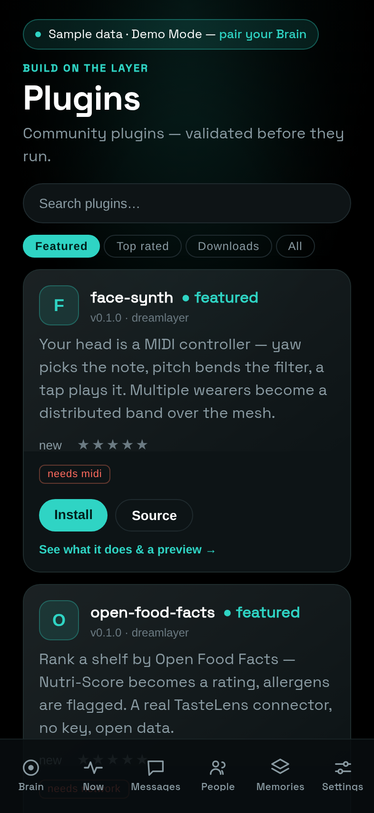

# The platform — plugins, the mesh, and the store

DreamLayer is becoming a platform: a supported way for anyone to extend the
glasses without forking the product. The plan is five pillars
(`docs/PLATFORM.md`), built in dependency order, and all five have landed
their first working layer. The through-line: the codebase already ran on
declarative registries (object-lens providers, glance candidates, brain
tiers) — the platform work formalizes those seams instead of inventing new
ones.

## Pillar 1 — real perception at Tier 0

`ai_brain/perception.py` gives the glasses' own silicon a first-class seat.
A `Perceptor` protocol (mirroring `VisionBrain`) emits typed
`PerceptSignals` — face present, text density, form fields, a question, an
object, a language guess — and a `PerceptionRouter` holds perceptors in
preference order, exactly like the brain router:

- **`HeuristicPerceptor`** ships today: zero-model coarse cues (text density
  from gradient statistics, object-ness from contrast) that feed the Glance
  Arbiter's cheap first pass.
- **`NpuPerceptor`** is the seam: `vision_fn` / `audio_fn` are where a
  Vela-compiled model for the Halo's Ethos-U55 NPU (about 46 GOPS int8)
  plugs in. It returns `None` until a model is wired, and the router falls
  back to the heuristic — so the arbiter gets model-grade signals the day
  hardware arrives, with no change to its logic.

## Pillar 2 — GhostMode mesh and The Beacon

Confluence's two-wearer bond, lifted to a **group** (`confluence/mesh.py`):
form a circle with a three-word code, and up to a whole crew shares one
ambient layer for a night (groups expire after 8 hours; a quiet member
fades from the circle in 12 seconds).

The privacy properties are structural: only *feeling* crosses the wire — a
weather scalar, a bearing, a gesture symbol — never speech, never
coordinates, never names (members are anonymous ids; names live only in
your local alias map). Packets are HMAC-signed with a key derived from the
group code; forged, replayed, stranger, and stale-group traffic drops
silently; the Veil silences your side of the mesh like everything else.

**The Beacon** is the first thing built on it: "find my group" as a feel,
not a map. Each member broadcasts a coarse bearing and a distance band
(close / near / far — never coordinates); your rim renders one pulse per
fresh member, nearer means brighter and faster, and a **BeaconCard** names
them from your local aliases ("Maya - close, ahead-left"). **Seam:** the
LE Coded PHY radio transport; an in-memory bus stands in for it in tests
and demos (15 tests cover the crypto, the drops, and the veil).

## Pillar 3 — the Plugin API

`plugins/base.py` is the supported extension surface — now formally
versioned and shipped as [the SDK](sdk.md) (`dreamlayer.sdk`, typed, with
its own CLI). A plugin is a name, a version, a list of required
**capabilities**, and one `register(ctx)` call. The registration hooks:

| Hook | What it extends |
|---|---|
| `add_object_provider` | a panel when you look at a matching object |
| `add_glance_candidate` | a lens the look can route to |
| `add_vision_brain` / `add_knowledge_brain` | a new brain tier |
| `add_perceptor` | a Tier-0 perception tier |
| `add_card_renderer` | how a custom card draws |
| `add_shop_provider` | a TasteLens data connector |

API v2 plugins can additionally *live* (`start`/`stop`/`tick` lifecycle),
*listen* (a veil-gated event bus — while the Veil is down, only the veil
event is delivered), and *remember* (per-plugin persisted settings) — the
detail is in [the SDK chapter](sdk.md#plugin-api-v2).

Capabilities are the permission system: a plugin declares what it needs
(`network`, `midi`, `mesh`, `cards`, `perception`, the `cloud_*`
entitlements...) and the host grants only what it can and will — `fs` is
withheld by default, `subprocess` and `ctypes` map to a capability that
cannot be declared at all (forbidden outright, not merely withheld),
`network` is revoked while the Veil is down, and a plugin requiring a
capability the device cannot grant is refused at install. A throwing
plugin is isolated; the registry records loaded / skipped / failed — and
untrusted plugins now run down an [isolation ladder](sdk.md#the-isolation-ladder)
(subprocess jail, OS sandbox where available, a WASM tier behind an
operator flag), watched by a capability-transparency log.
There is also a **plan seam** on top: a paid plan can grant extra
capabilities beyond the free set, though today the free plan grants
everything — the honest state of that seam is in
[DreamLayer Cloud](cloud.md).

Want to write one? `dreamlayer plugins new` scaffolds an API v2 plugin in
one command ([the SDK](sdk.md)); the ten-minute tutorial plugin,
`examples/hello-lens/`, is CI-tested and walked through in
[Open source](open-source.md). Want to build one *without* code? That is
[the Lens Builder](lens-builder.md).

## Pillar 4 — TasteLens

The first-party lens built *on* the plugin seams, proving them: the ranking
engine is core, but its data connectors are ordinary plugins through
`add_shop_provider`. Full chapter: [Scholar and TasteLens](world-lenses.md).

## Pillar 5 — the WebBLE playground

Drive the actual glasses from a browser tab — no app store, no install.
`web/playground.html` (also live on the site at
[dreamlayer.app/playground](https://dreamlayer.app/playground.html)) speaks
Lua over the Nordic UART BLE service, the same transport the phone hub
uses: connect, run canned HUD demos, or type Lua into a live REPL. Works in
Chrome and Edge on desktop and Android; it detects browsers without Web
Bluetooth (every iOS browser, Firefox) and says so honestly instead of
showing a dead button.

The first plugin shipped with it: **Face Synth** — head yaw picks the note
(quantized to a scale, so there are no wrong notes), pitch bends
expression, a tap plays, and several wearers become a band over the mesh,
one MIDI channel each. **Seam:** the MIDI bridge (`midi_out`); the plugin
stays dormant until one exists.

## The marketplace

A plugin ships as a **package**: a manifest (name, semver, entry point,
required capabilities, sha256 checksum of the source, author copy and
screenshot kept outside the checksum so copy edits do not re-sign code)
plus one Python file. Every install — store or sideload — passes the
validation gate, now **five defences**:

1. Manifest shape (name/version/entry/api rules, only known capabilities)
   plus an SDK-compatibility check: a plugin declaring `min_sdk` newer
   than the host is refused by name.
2. Integrity — the checksum must match, twice (registry-advertised and
   fetched).
3. Authenticity — a manifest-bound Ed25519 signature when present (a bad
   signature is a hard error; unsigned installs under curated-registry
   trust with a warning).
4. A static AST scan — `subprocess`, sockets, `ctypes`, file deletion,
   `eval`/`exec`/`pickle` are flagged; each allowed only if the matching
   capability was declared, some forbidden outright.
5. A smoke load against a mock context granting only declared
   capabilities — **opt-in author tooling only** since the secure-defaults
   pass: validating a package on the install path never executes its code.

The honest limit, stated in `docs/MARKETPLACE.md`: in-process Python cannot
be perfectly sandboxed — the gate is defense-in-depth for a curated,
reviewed registry, with signatures and real isolation as the hardening
path.

### The store, in three places

- **The website — [dreamlayer.app/plugins](https://dreamlayer.app/plugins.html):**
  browse, search, Featured / Top rated / Most downloaded tabs, per-plugin
  detail with the author's screenshot, plain-English permissions, star
  rating, and a copy-install action.
  Search is one ranked, typo-tolerant scorer (fielded weights, a curated
  concept map, one-edit tolerance) shared verbatim by the store page, the
  phone, and the Worker's search route — the same query ranks the same
  everywhere.
- **The phone** — the Plugins screen (Settings, "Build on the layer"):
  same catalog, install/remove, one-tap rating, and a permissions alert
  before any install ("This plugin will be able to use: ..."). Installs
  work in production now: the store's catalog is bundled with the deployed
  site, the phone fetches the package and **sideloads** it to the paired
  Brain, and the Brain's real validation verdict is what the user sees.
  The phone never runs plugin code; with no Brain paired, the install
  queues locally and is delivered the moment one pairs.
- **The Mac panel** — the Plugins card: what is installed, what this Brain
  can grant, per-plugin remove, and a sideload box that passes the same
  gate:

*A real session demonstrating the gate: two registry plugins installed; a
third (hud-reactions) refused because that machine could not grant the
`mesh` capability it requires. Since then the Brain has learned to grant
`mesh` and `shop` (pinned by `test_plugin_install_real.py`), so today
every plugin in the registry — hud-reactions included — installs; the
refusal path still fires for a capability the host genuinely lacks.*

### The social layer — live at api.dreamlayer.app

Ratings, downloads, and comments live in a deliberately separate service:
a Cloudflare Worker at **[api.dreamlayer.app](https://api.dreamlayer.app)**
(`registry-api/`, KV-backed; the bare root redirects to the store). The
contract began as five routes — list stats, per-plugin stats and comments,
rate, comment, record a download — and has since grown the waitlist and
the [community layer](community.md) (figment gallery submissions, verified
Figment Golf, Lens Jams), all rate-limited per IP and hardened against
stored-XSS and index pollution. The split is a security decision — **the API
serves only numbers, never plugin code**. The catalog itself is git-backed
and validated (`registry/`), and clients merge the two by name, falling
back to their bundled snapshot when the API is unreachable. Compromising
the social service cannot ship code to anyone.

### The registry today

Six plugins, every one passing the gate in CI (`registry/packages/`) —
all now **API v2**, all carrying the "Official — DreamLayer team" badge
(the store renders it), all free (the paid-store UX exists behind a
payments flag that is off; see [the community layer](community.md#the-store-meanwhile)):

| Plugin | What it does | Needs |
|---|---|---|
| `open-food-facts` | TasteLens connector — Nutri-Score to rating, allergens flagged | network |
| `currency-converter` | look at a foreign price tag, see your money, live rates | object_lens, network |
| `hud-reactions` | throw a reaction onto your HUD, shared to your GhostMode circle | cards, mesh |
| `filler-word-counter` | a perceptor that tallies "um / uh / like" as you speak | perception, cards |
| `face-synth` | your head as a MIDI instrument; wearers form a band over the mesh | midi |
| `air-drums` | gesture-zone drum kit on MIDI channel 10 | midi |

## Hardening in the record

One more platform property worth naming: **a performance can never crash
the Brain.** The Reality Compiler's rehearsal endpoint wraps inference in a
last-resort net — any pathological beat combination returns an honest
"CAN'T DO THAT" teach card instead of a 500 — and the choreographer was
fixed so repeated counting beats feed one counter. The store, the gate, and
the rehearsal surface are all built on the same assumption: outside input
is hostile until proven otherwise.
