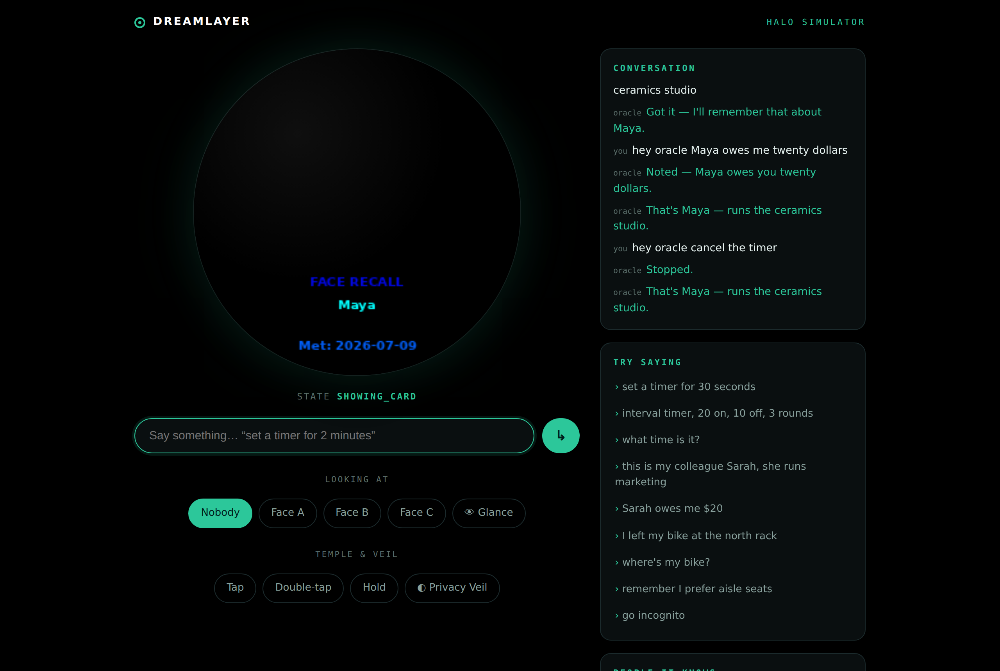
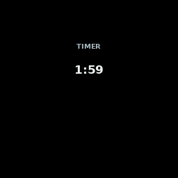
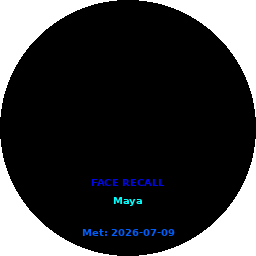
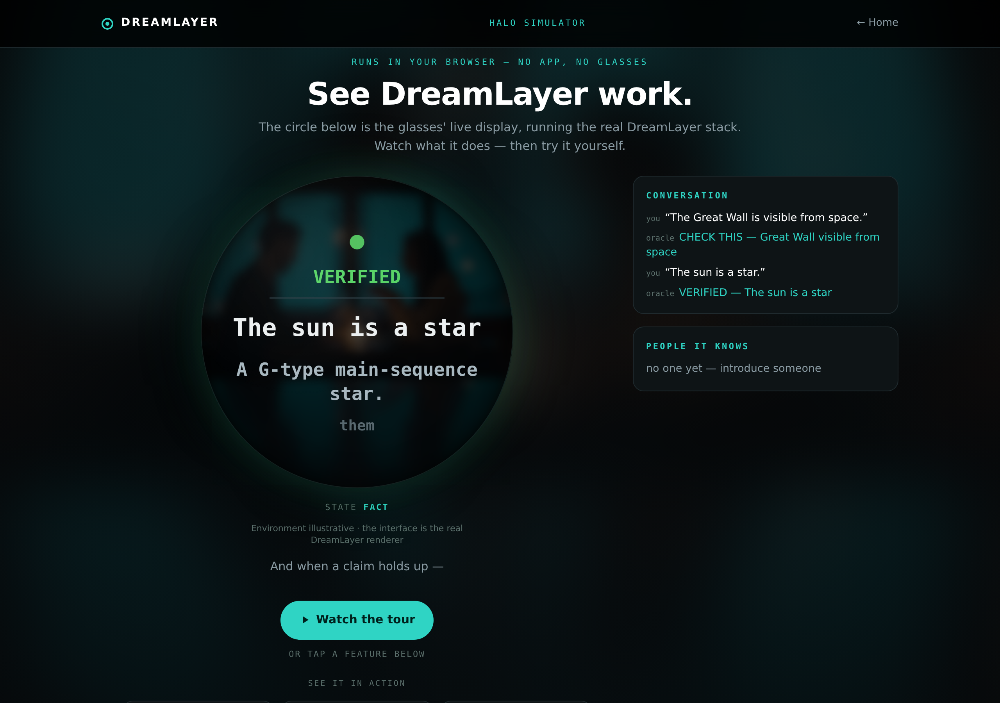

# The Halo Simulator — the whole product, no glasses

DreamLayer now runs end to end with zero hardware, twice over: a **Python
simulator** that drives the real stack for development, and an **in-browser
simulator** anyone can open at
[dreamlayer.app/simulator.html](https://dreamlayer.app/simulator.html). They
are deliberate twins — the browser one is a faithful client-side port, and
the Python one stays the real-stack tool.

## The Python simulator — the real stack

`python -m dreamlayer.simulator` (default `127.0.0.1:8765`) boots the
**actual product**: a real `Orchestrator` over an emulator bridge, voice
routed through the genuine "Hey Juno" surface, the glass rendered by the
same renderer that produces this book's card images, and Reality Compiler
figments replayed through the reference Python stage interpreter (the
parity-pinned twin of the device Lua). Only the hardware is faked: typed
text stands in for ASR, and "look at" supplies one of three synthetic
camera faces so introductions and recall exercise the real Social Lens.

A real session, driven over its little HTTP API:

| "Set a timer for 2 minutes" — a live figment counting down | "Hi, I'm Maya" then a glance — real Social Lens recall |
|---|---|
|  |  |

The API is four POSTs and two GETs: `/sim/voice {text, look?}`,
`/sim/glance {look?}`, `/sim/gesture {name}`, `/sim/veil {on}`;
`/sim/frame.png` returns the current 256 x 256 glass and `/sim/state` the
transcript, people, and figment state. Everything in this section was
captured through exactly that API — including watching the veil black the
frame.

## The in-browser simulator — anyone, right now

The public one is a single static page: the voice grammar, Social Lens,
Waypath, native timers, and the HUD renderer ported line-for-line to
JavaScript and drawn on a canvas, with a Node harness holding the port to
the Python test cases. Six driven scenes — remember a face, never lose
things, answer on the glass, **live fact-check**, morning brief, the
Privacy Veil — plus a guided tour, a free-typing box, optional
browser-microphone voice input, and look-at face chips.

Below the scenes sits the interactive **"Try it yourself"** panel — the
free-typing box, gestures, look chips, and example asks. On a desktop it
opens itself (the whole point of the page is trying it); on a phone it
stays collapsed to protect the fold, one tap away.

The page is honest about its own construction, on the page: the scenery
behind the lens is illustrative, and every pixel *on* the lens is the real
renderer's output. It runs with no backend at all — nothing typed into it
leaves the browser.

And it is held to product standards, not demo standards: a **42-check
Playwright QA** drives every control end to end on desktop and mobile —
all six scenes, the guided tour and its any-touch abort, every intent
family in the ask box, introduce-then-glance recall, waypath stash and
recall, all three gestures, and the full Privacy Veil contract (writes
refused, recall blind, clean lift) — with zero JavaScript errors on both
viewports. One agreement bug that pass caught is worth recording: the
status line used to say `timer` while a freshly-triggered card was
interrupting the countdown on the glass; the status read now mirrors the
renderer's own precedence, so the text and the lens can no longer
disagree.

## Why two

- The **browser** simulator is the front door: the product's feel, thirty
  seconds after hearing about it, on any device.
- The **Python** simulator is the workbench: the same orchestrator, ledger,
  grammar, and stage that ship — so a bug reproduced in the simulator is a
  bug in the product, and a feature demoed there is a feature that exists.

Both make the pre-hardware claim concrete: the software is not waiting on
the glasses to be real.
