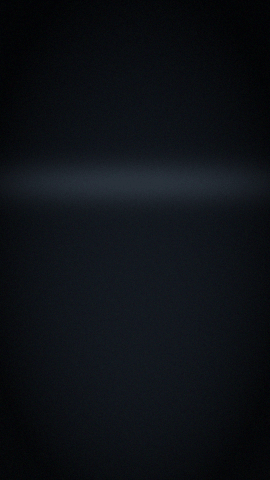

# Truth and discernment

DreamLayer's flagship capability is a live read on what is being said to you:
**Veritas** checks the *content* of claims, **Truth Lens** reads the
*delivery*, and **Discernment** fuses the two — plus the speaker's history —
into one graded stance. The three are deliberately separate engines answering
different questions on different inputs, composed at the end. A fourth
conversational copilot, **answer-ahead**, rides the same caption stream.

Everything in this chapter is engineered to *underwhelm on purpose*: strict
claim filters, confidence floors, per-speaker cooldowns, and an explicit
"unverified" verdict. A fact-checker that fires constantly, or overclaims, is
worse than none.

## Veritas — the live fact-checker

Off by default; enabled with `set_factcheck(True)` (the phone's "Live
fact-checker" toggle). While on, every other-speaker line landing in
`ingest_caption` runs two passes (`orchestrator/veritas.py`):

### Pass 1 — self-contradiction (fully offline)

The line is compared against the *same speaker's own earlier lines* from the
conversation ledger, using Candor's `contradicts` predicate (at least two
shared content words with an opposing assertion). A clash produces the
strongest verdict in the system — `self_contradiction`, confidence 0.9 — with
the receipt quoted on the card: *earlier: "we settled at two million"*. No
network, no model, no cloud: this pass works on a plane.

### Pass 2 — the world check

Only a **checkable claim** is ever escalated:

- Not a question (trailing "?" disqualifies).
- Not hedged — a leading "I think / maybe / probably / it seems / in my
  opinion..." disqualifies.
- And it must either contain a **number-like** fact (years, percentages,
  quantities, money, distances) or a **factual predicate** (an is/are/was
  assertion touching a fact word: capital, invented, founded, discovered,
  largest, president, boiling point...).

The claim goes to `_verify_claim`, which is real and tiered: it wraps the
claim in a tightly-shaped verification prompt
(`ai_brain/verify.py: VERIFY_PROMPT` demands exactly one line —
`VERDICT: SUPPORTED|DISPUTED|UNVERIFIED — reason`) and routes it through
`brain.ask` — **your local model first, the cloud tier only if you have
opted in, and never while incognito**. The reply is parsed into
`{verdict, basis, confidence}`: unverified maps to confidence 0.3; supported
and disputed map to 0.8, knocked down to 0.55 if the model hedged. If no tier
can answer (offline, no model), the seam returns `None` — and the offline
self-contradiction pass still stands alone.

### When it actually speaks

Sparingly, by construction:

- **One verdict per speaker per 45 seconds** (per-speaker cooldown).
- Above the floor only: a `disputed` needs confidence >= 0.55; a `supported`
  needs >= 0.85 to bother congratulating anyone.
- Held during Focus; silenced by the Veil.

### The card

Verdict tone is resolved on the device renderer itself, so a wire-delivered
card can never lose its color: green **VERIFIED** (chime earcon), amber
**CHECK THIS** (urgent hark earcon, double haptic, flash), red **THEY SAID
DIFFERENT BEFORE** (hark, double haptic, flash), ghost **UNVERIFIED** (hark).
Dismisses after 7 seconds.

## Truth Lens — the delivery read

Off by default; enabled with `set_truthlens(True)`. Where Veritas asks *is
the claim true*, Truth Lens asks *how is it being delivered* — a nine-stage
multimodal pipeline (`truth_lens/`): face embedding, action-unit detection,
prosody, linguistic analysis, baseline lookup, fusion, rendering, baseline
update, and a disabled fact-check stub (Veritas owns content).

Three channels, honestly labeled:

| Channel | Weight | Status |
|---|---|---|
| Micro-expression (AU) | 0.35 | **Seam** — fed by `observe_face(frame)` |
| Voice stress (prosody) | 0.35 | **Seam** — fed by `observe_voice(mic_fft, amplitude)` |
| Linguistic | 0.30 | **Computed live** from each caption: hedging (0.30), first-person distancing (0.25), complexity (0.25), negation (0.20) |

### Calibration is the point

Every read is scored as a z-score against that person's **own baseline**
(`set_contact`), built with an online Welford update. A baseline needs **10
samples to calibrate**; until then the person is treated as a stranger, and a
stranger's micro-expressions stay noise: stranger fusion only alerts if *all*
channels exceed 0.75, and its confidence is fixed at 0.2. The output is a
`CredibilityVector` — deception probability, confidence, per-channel
z-scores, dominant channel, stranger flag — with labels stepping CREDIBLE
(< 0.40), UNCERTAIN (< 0.65), ELEVATED (< 0.85), HIGH ALERT (>= 0.85), and
CALIBRATING below 0.3 confidence.

On glass it renders as the testimony thread — nine stages around the ring,
truthful stages as continuous arc, deceptive ones torn:

With Truth Lens on, the orchestrator runs a delivery read for the current
speaker on every other-speaker line (`_read_delivery`), *without* the HUD
display gate — because Discernment wants the reassuring reads too — and feeds
the result in via `note_credibility(speaker, vector)`.

## Discernment — three lenses, one read

`orchestrator/discernment.py: discern(fact, credibility=None, history=0)`
composes content, delivery, and history into one stance. The scoring is
plain and inspectable:

- Content concern: self-contradiction 0.85, disputed 0.80, unverified 0.20,
  supported 0.
- Delivery counts only once the baseline is calibrated (vector confidence
  >= 0.3): deceptive at deception probability >= 0.65, credible below 0.40.
  Delivery contributes at half weight.
- History: each prior flag on this speaker adds 0.15, capped at three.
- **Synergy:** a false claim delivered deceptively earns an extra 0.2 —
  content and delivery *agreeing* is the strongest signal there is.

The weight maps to a stance: **flag** (>= 0.8), **caution** (>= 0.5),
**note** (>= 0.25), **trust** — and a human headline that says what the
fusion actually thinks:

> "Doesn't add up — and it didn't sound like it, either."
> "The claim is off, but they seem to mean it." — a false claim delivered
> sincerely reads as an honest mistake, not a lie.
> "Checks out — but the delivery was uneasy."
> "They contradicted their earlier words. Not the first time."

The stance and headline land on the FactCheckCard, and the footer carries the
tag ("Marcus - elevated - seen before").

## Answer-ahead — the conversational copilot

Off by default; enabled with `set_copilot(True)` (the phone's "Answer-ahead"
toggle). When *someone else* asks a question in the caption stream,
`orchestrator/answer_ahead.py` decides whether it is a real, answerable
question — a wh-question, or one aimed at you — and never a rhetorical
"...right?" or "you know?". If so, it pre-fetches the answer from your own
knowledge through the same tiered router (cloud only when opted in) and
flashes an **AnswerAheadCard** you can read and say yourself.

Its manners are the feature: no wake word, **no earcon — silent by design**
(a tick haptic only), a cooldown between fires, a confidence floor beneath
which nothing surfaces, held during Focus, gated by the Veil, and a clean
miss (offline or low confidence) surfaces nothing at all.

## What is implemented versus seam, precisely

| Piece | Status |
|---|---|
| Claim detection, self-contradiction pass, cooldowns, thresholds, cards | Implemented and tested |
| World check plumbing (`verify_claim`, prompt, parsing, tier routing, incognito/cloud gates) | Implemented and tested |
| A live verification *model* behind it | **Seam** — Ollama on the Brain and/or the opt-in cloud tier answer it; with neither, world checks return nothing and only pass 1 runs |
| Truth Lens linguistic channel, baselines, fusion, gauge | Implemented and tested |
| Truth Lens face and voice channels | **Seam** — `observe_face` / `observe_voice` accept device frames; tests feed synthetic ones |
| Discernment fusion and stances | Implemented and tested |
| Answer-ahead detection, pacing, card | Implemented and tested; the answer itself rides the brain seam above |
