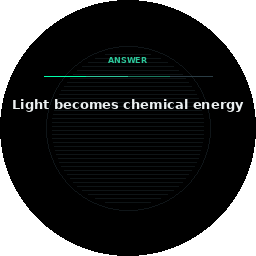
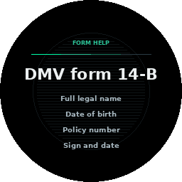
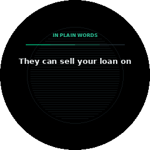
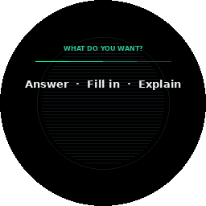

# Scholar and TasteLens — the World lenses

Two lenses turn "look at a thing" into "get the thing done": **Scholar**
reads what is written in front of you — a question, a form, dense prose —
and **TasteLens** ranks what is in front of you — a shelf, a menu. Both are
routed by the [Glance Arbiter](attention-focus.md#the-glance-arbiter--which-lens-owns-a-look)
(the look decides the lens; no mode picker) or invoked by voice, and both
share one honest failure state: with no Brain to read through, they show
"Connect a Brain to read this" instead of a guess.

## Scholar — read it, fill it, say it plainly

`orchestrator/scholar.py`. One class, three capabilities, each returning a
`ScholarResult` and a **ScholarCard** (dismiss 9 s, eyebrow by mode):

### Answer — "what's the answer?"

`answer(frame, question="")` reads the question in view and answers it. The
prompt demands a structured `ANSWER:` / `WHY:` reply; confidence is 0.85,
knocked to **0.55 when the model hedges** (the same hedge-word discipline as
Veritas). Voice: *"what's the answer"*, *"answer this"*, *"solve this"*.

### Form help — "how do I fill this out?"

`form(frame, purpose="")` reads a form and returns a summary plus one
`FIELD: label — what to write` line per field (up to six listed on the
card). Voice: *"how do I fill this out"*, *"fill out this form"* — with an
optional purpose ("...to change my address").

### Plain words — "what does this mean?"

`explain(frame)` turns dense text — a contract clause, a spec, legalese —
into a gist plus key points. Voice: *"explain this"*, *"what does this
mean"*, *"summarize this"*, *"put this in plain English"*, *"break this
down"*.

### How it reads, and what gates it

The vision seam is injected (`read_fn`); the orchestrator wires it to
`brain.explain` — **local vision model first, cloud only when opted in,
never while incognito** — with a text-knowledge fallback through
`brain.ask`. Veil-gated at the read. A spoken Scholar phrase also arms the
Glance Arbiter for **6 seconds**: say it, then look, and the next glance
routes straight to that mode. Tests: `test_scholar.py`, including
`no_brain_returns_an_unavailable_card_not_a_guess`.

### The chooser

When a look is genuinely ambiguous — a page that could be a question, a
form, or prose — the arbiter shows the **GlanceChoiceCard** (dismiss 6 s, up
to three one-tap options). A pick runs the lens *and* teaches the arbiter's
per-scene priors, so tomorrow's ambiguous look leans your way:

## TasteLens — the real-world choice oracle

`orchestrator/taste.py`. Look at a shelf or a menu and get the pick — with
the *why* spelled out, and nothing silently hidden:

### The ranking rules (pure, offline-testable)

`rank(items, profile, budget)` is deliberately plain:

- **Dietary vetoes are hard.** A "no dairy" profile hit sinks an item to the
  bottom, flagged with a cross — shown last, never silently dropped.
- **Budget is a soft gate.** Over-budget items rank below eligible ones but
  above vetoes.
- **Score** = rating (out of 5) plus a small cheaper-is-better tiebreak
  (capped at 0.1, so price can never overturn a full rating point).
- Sort is stable and honest: eligible, then over-budget, then vetoed.

The winner renders in hero type with its reasons ("no dairy - 4.6 stars -
$3.20"); runners-up stack beneath with theirs.

### The two seams, and the first connector

`read_fn(frame)` turns the shelf into labeled items (routed through the
Brain's vision tier under the usual cloud rules), and `shop_fn(label,
attrs)` fills in ratings and prices. Shop providers are a **plugin
extension point** (`add_shop_provider`) — the first real one is the
**Open Food Facts** connector: Nutri-Score becomes a rating (A maps to 4.8,
E to 1.0), allergens are flagged into the veto path, results are cached
per label for 300 seconds (misses too, so a miss is not retried every
glance), and transient network errors retry twice with backoff while 4xx
errors never retry. Multiple providers merge first-provider-wins per field,
each isolated so one failing connector cannot break the read.

### Routing and gating

The arbiter's TasteLens candidate bids 0.88 on a `shelf` or `menu` scene
(0.6 when at least two items are visible in any scene). Veil-gated;
unavailable state when nothing reads. Tests: `test_taste.py` and
`test_taste_connector.py`.

## Rendering status

ScholarCard, GlanceChoiceCard, and TasteCard render through the Python
mirror's shared World-lens material family today (every image above is that
renderer's real output); their device-Lua renderers are the next O3-style
pass — the same path FactCheck and Hark took from mirror to glass.
